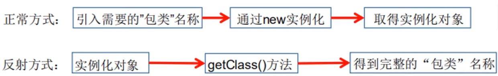
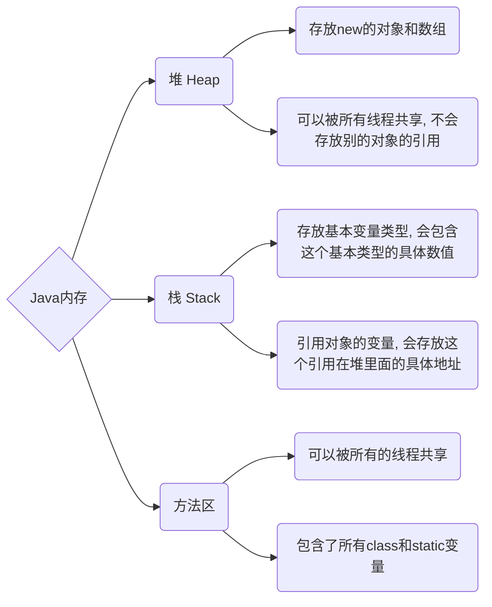
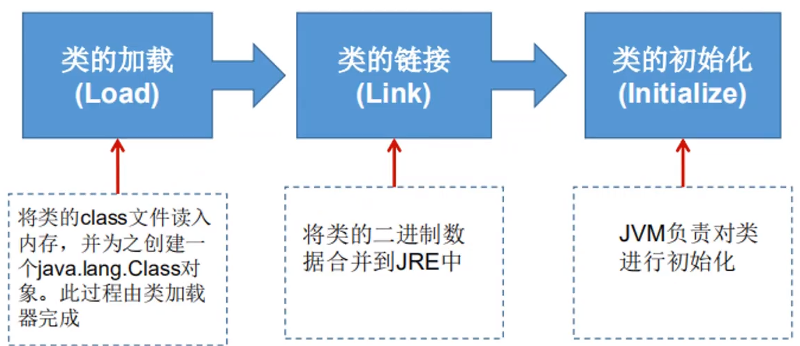
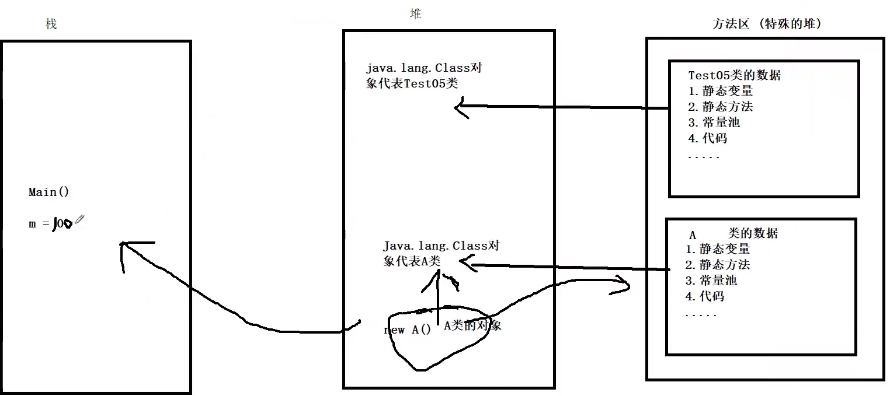
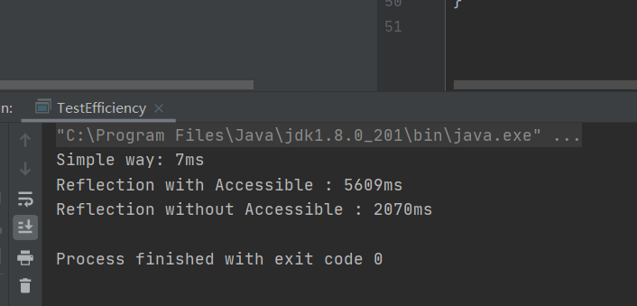

# 注解

## 注解的作用

- 不是程序本身，可以对程序作出解释

- 可以被其它程序读取

  

## 内置注解

- @Override 打算重写方法时使用
- @Deprecated 表示不要使用该方法
- @SuppressWarnings 抑制编译时的警告信息，这个注解需要添加参数才能使用


## 元注解

元注解 (meta-annotaion) 的作用是：负责注解其它注解

- @Target: 用于描述注解的使用范围
- @Retention: 表示需要在什么级别保存该注解信息 （Source < Class < Runtime）
- @Document: 说明该注解将被包含在javadoc里面
- @Inherited: 说明子类可以继承父类中的注解


## 自定义注解

使用@Annotation自定义注解

- @interface用来声明一个注解，格式为：public @interface **注解名** {**定义内容**}
- 其中的每一个方法实际上是声明了一个配置参数
- 方法名称就是参数的名称，返回类型就是参数类型
- 可以通过default来声明参数的默认值
- 如果只有一个参数，一般用value
- 注解元素必须要有值，所以定义时，通常使用空字符串或者0作为初始值


注解作用：

- 可以附加在package, class, method, field上面，相当于给它们添加了额外信息，我们可以通过反射机制编程实现对这些元数据的访问。


# 反射机制

## 动态语言

是一类在运行时可以改变其结构的语言：例如新的函数、对象、甚至代码可以被引进，已有的函数可以被删除或是其它结构上的变化。也就是说，运行时代码可以根据某些条件改变自身结构。(e.g. Object-c, C#, Python)

## 静态语言

运行时结构不可改变的语言就是静态语言。(e.g. Java, C, C++)

> Java不是动态语言，但因为反射，java也可以利用反射机制获得一定的类似动态语言的特性


## 实现反射

```java
Class c = Class.forName("java.lang.String")
```

加载完类之后，在堆内存的地方中就产生了一个Class对象（一个类只有一个Class对象），这个对象就包含了完整的类的信息。可以通过这个对象看到类的结构。




## 反射特点

- 优点：可以实现动态创建对象和编译，体现灵活性。
- 缺点：对性能有影响，这类操作总是慢于直接执行的操作。


## 获取Class类的几种方法

| 方法名                                   | 功能说明                                  |
| ---------------------------------------- | ----------------------------------------- |
| static Class.forName(String name)        | 根据名字获取指定类                        |
| Object newInstance()                     | 调用缺省构造方法，返回Class对象的一个实例 |
| getName()                                | 返回Class对象所表示的实体的名称           |
| Class getSuperClass()                    | 返回其父类Class对象                       |
| Class[] getInterfaces()                  | 获取当前Class对象的所有接口               |
| ClassLoader getClassLoader()             | 返回该类的类加载器                        |
| Constructor[] getConstructors()          |                                           |
| Method getMethod(String name, Class...T) |                                           |
| Field[] getDeclaredFields()              |                                           |


### 获取Class对象常用方法

- Class clazz = Person.class 											最可靠, 程序性能最高
- Class clazz = person.getClass()                                    调用实例的getClass获取class对象
- Class clazz = Class.forName("demo01.Student")      通过Class类的静态方法获取, 可能会有ClassNotFoundException
- 还可以通过ClassLoader获取........


### Spring的bean获取Class对象方法

另外对于Spring中的bean对象，很多entity或者dto里面的属性都是private的。但是可以通过以下方式来获取到该对象的值：

```java
Class clazz = EkycMchInfoDto.class;
// 获取对象包含的属性的名称
Field[] declaredFields = clazz.getDeclaredFields();
// 对属性进行遍历
for (Field field : declaredFields) {
    // 根据属性名, 获取其get方法
    PropertyDescriptor pd = new PropertyDescriptor(field.getName(), clazz);
    Method getMethod = pd.getReadMethod();
    // 调用对应get方法获取值
    Object value = getMethod.invoke(ekycIndoDto_1);
}
```


## 类加载内存分析



### 类的加载过程

当程序主动使用某个类时，如果该类还未被加载到内存中，则系统会通过如下三个步骤来对类进行初始化。



- **加载**：将class文件的字节码内容加载进内存中，并将这些静态数据转换成方法区的运行时数据结构，然后生成一个代表这个类的java.lang.Class对象
- **链接**：将Java类的二进制代码合并到JVM的运行状态之中的过程
  - 验证：确保加载的类信息复合JVM规范，没有安全的问题
  - 准备：正式为类变量（static）**分配内存**并**设置类变量默认初始值**的阶段，这些内存都在方法区中进行分配
  - 解析：虚拟机常量池内的符号引用（常量名）替换为直接引用（地址）的过程、
- **初始化**：
  - 执行类构造器的过程，自动收集赋值操作和静态代码块中的语句
  - 如果发现其父类未被初始化，首先初始化其父类
  - JVM会保证一个类的初始化方法，在多线程环境中被正确加锁和同步


### 步骤示例



> 1. 加载到内存，产生一个类对应的Class对象
>
> 2. 链接，链接结束后 m = 0
>
> 3. 初始化：
>
>    ​	<clinit>() {
>
>    ​			m = 300;
>
>    ​			m = 100;
>
>    ​	}
>
>    ​	m = 100


### 什么时候发生类的初始化

#### 类的主动引用（一定会发生类的初始化）

- 当虚拟机启动，先初始化main方法所在的类
- new一个类的对象
- 调用类的静态成员（除了final常量）和静态方法
- 使用java.lang.reflect包的方法对类进行反射调用
- 当初始化一个类，但其父类没有被初始化，先初始化其父类


#### 类的被动引用（一定不会发生类的初始化）

- 当访问一个静态域时，只有真正声明这个域的类才会被初始化。例如：当通过子类引用父类的静态变量，不会导致子类初始化
- 通过数组定义类引用，不会触发此类的初始化
- 引用常量不会触发此类的初始化（因为常量在链接阶段就存入调用类的常量池中了）


## 类加载器

### 类加载器的作用

- 将class文件字节码内容加载到内存中，并将这些静态数据转换成方法区的运行时数据结构，然后在堆中生成一个代表这个类的java.lang.Class对象，作为方法区中类数据的访问入口。


### 类缓存

- 标准的JavaSE类加载器可以按要求查找类，但一旦某个类被加载到类加载器中，它将维持加载一段时间，JVM的GC回收机制可以回收这些Class对象。


### 类加载器分类

- 引导类加载器：C++编写，JVM自带的类加载器，负责**Java平台核心库**，用来装载核心类库，无法直接获取。
- 扩展类加载器：负责jre/lib/ext目录下的jar包装入工作库
- 系统类加载器：负责java classpath下的jar包装入工作库


## 获取到Class对象后的作用

```java
Class c1 = Class.forName(".....");

/** 不使用new来新建对象 */
// 1. 调用无参构造器
User user = (User) c1.newInstance(); 

// 2. 获得构造器, 然后再建立
Constructor constructor = c1.getDeclaredConstructor(String.class, int.class, int.class);
User user2 = (User) constructor.newInstance("", 0, 0);


/** 通过反射调用普通方法 */
Method setName = user.getDeclaredMethod("setName", String.class);
setName.invoke(user, "NewName");

/** 通过反射操作属性 */
Field field = user.getDeclaredField("name");
// 取消安全检测, 才可以对private属性进行操作, 同时取消之后会提升反射的效率
name.setAccessible(true);
name.set(user, "NewSettingName");

```


## 性能对比




## 反射操作泛型

- ParametherizedType：表示一种参数化类型，e.g. Collection<String>
- GenericArrayType：表示一种元素类型是参数化类型或者类型变量的，数组类型
- TypeVariable：是各种类型变量的公共父接口
- WildcardType：代表一种通配符类型表达式

```java
Method test01 = TestGenericReflection.class.getMethod("test01", Map.class, List.class);
        // 获取泛型的参数类型
        Type[] genericParameterTypes = test01.getGenericParameterTypes();
        for (Type genericParameterType : genericParameterTypes) {
            System.out.println("outside type " + genericParameterType);
            // 判断当前泛型的参数, 是否等于结构化泛型参数
            if (genericParameterType instanceof ParameterizedType) {
                Type[] actualTypeArguments = ((ParameterizedType) genericParameterType).getActualTypeArguments();
                for (Type actualTypeArgument : actualTypeArguments) {
                    System.out.println("inside type " + actualTypeArgument);
                }
            }
        }
        System.out.println();


        Method test02 = TestGenericReflection.class.getMethod("test02");
        Type genericReturnType = test02.getGenericReturnType();
        System.out.println("outside return type " + genericReturnType);
        if (genericReturnType instanceof ParameterizedType) {
            Type[] actualTypeArguments = ((ParameterizedType) genericReturnType).getActualTypeArguments();
            for (Type actualTypeArgument : actualTypeArguments) {
                System.out.println("return inside type " + actualTypeArgument);
            }
        }
```


# 反射操作注解

只需要通过获取其annotation, 即可使用.value()获取其中注解的内容


