# 解析分析

## 央行数字货币基本要点

### 1. 是中央银行的负债

由中央银行进行信用担保，具有无限法偿性（不能拒绝接受）

### 2. 投放模式为“双层运营体系”

上层是央行对商业银行，100%准备金兑换给商业银行。下层是商业银行对公众，商业银行兑换给公众

# 背景

Facebook的Libra使用的是加密货币，它的想法是实现一种单一法币抵押型稳定币：使用美元。相当于你存100美元进去，就获得100Libra币，你取出100美元时，既销毁这100Libra。因此Libra没有特别的炒作空间，相当于一种现实资产的隐射。可以看出，作为数字货币中的一种，如果使用Libra进行跨境转账或者消费，手续费可以为0。但他说的与 “一揽子货币” 进行挂钩，但是没有说清楚具体哪些货币。与此同时，不在这一揽子货币下的其它货币将会被边缘化。

## 数字货币，电子货币，加密货币和法定数字货币

数字货币几乎是后面这些货币的总称，法定数字货币与其他比特币等最大的区别——**法定数字货币不一定基于区块链发行，也可以基于传统的集中式账户体系发行**。

而现在普遍使用的支付宝微信等电子支付工具都与银行账户**紧耦合**，相当于是法币的一种**数字化使用方式**。

## 人民币1.0, 2.0, 3.0

- 1.0：纯纸币
- 2.0：流通在银行等金融体系内的现金和存款实现数字化，而支付宝与微信等第三方移动支付工具也让流通中的现钞比例大幅下降。
- 3.0：法定数字货币

目前央行的法定数字货币主要是打算进一步替代1.0中的比例，进而实现纸钞，硬币的数字化。而且数字货币由于区块链技术的加持，较硬币和纸币的防伪技术简单且先进不少。同时，数字货币的交易将会非匿名，不能用于洗钱等。央行观点：当触发到非法活动时，将会追踪交易，但普通交易时将不会查看交易，比支付宝或微信这种捆绑银行账户的支付方式更加保护隐私。

> M0：流通于银行体系之外的现金
>
> M1：狭义货币，M1=M0+企业在银行的活期存款
>
> M2：广义货币，M2=M1+准货币，包括所有存款，定期，不动产

### 法定数字货币的投放方式

将会与目前纸币的投放方式相同，采用双层运营体系。

### 央行对数字货币的定位

央行并不强制采用区块链技术，目前设计主要针对小额零售的高频场景，关键为高并发。交易系统的性能至少每秒30w笔以上的水平，区块链目前很难做得到。但央行不排斥使用区块链分布式账本，或者使用传统的账户体系，这个由商业银行自行选择。

## 如何使用央行数字货币

央行数字货币旨在将银行账户和货币实现解耦，数字货币可以脱离传统银行账户，使得交易对账户的依赖进一步降低。

小额支付可以直接下载央行数字钱包，使用手机号注册即可进行转账。但是大额支付需要提前预约。同时根据kyc进行分级，不同的人额度不一样，提交更多身份信息可以获取跟高的额度。

同时，某些只允许使用支付宝结账（淘宝）等，支付渠道被独占的地方，都可以使用央行数字货币进行支付。（后续可能会有使用支付宝可以更便宜等情况出现）。而且央行数字钱包可以实现离线转账。

重点：**支付宝，微信等第三方支付工具也可以使用央行数字货币进行支付，这意味着支付方式从银行账户结账，改为可以选择使用数字钱包进行支付**。

## 央行数字货币的顶层设计

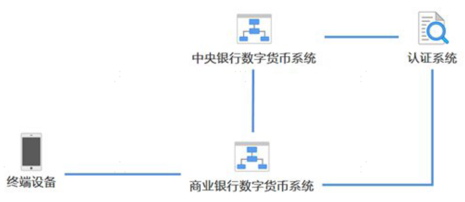

- 中央银行数字货币系统：产生和发行数字货币，以及对数字货币进行权属登记
- 商业银行数字货币系统：针对数字货币执行银行功能
- 认证系统：为中央银行数字货币系统和数字货币用户所在终端交互，以及中央和商业银行之间的交互，提供认证

### 法定数字货币的发行

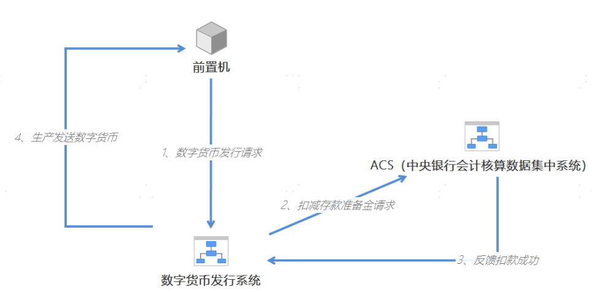

发行方式：

1. 接收申请方发送的数字货币发行请求
2. 对数字货币的发行请求进行业务核查，在核查通过后对会计核算数据集中系统发送扣减存款准备金请求
3. 接收到扣款成功通知后，发送数字货币

### 法定数字货币的流通

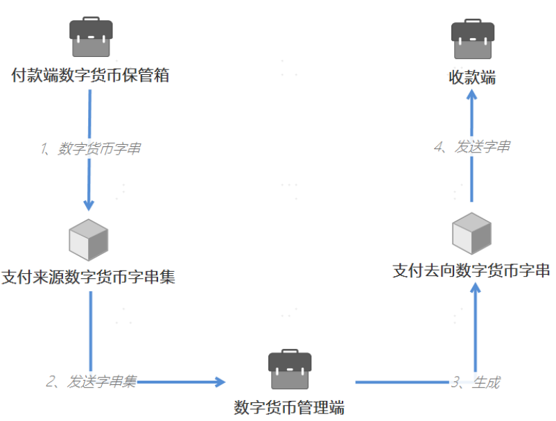

具体支付流程：

1. 付款方根据付款金额，以及预先定义的匹配策略，从付款方的数字货币保管箱中选择一定数量的数字货币串。将这些字符串，组成支付来源数字货币串，然后发给管理端。这个来源字符串，包含金额字段，所有者字段。
2. 管理端将这些受到的数字货币字符串全部作废，根据这些字符串的金额生成新的支付去向数字货币字串，金额字段还是付款发过来的，而所有者字段则更改为收款方。

其中：管理端可以定义**双路规则**

- 收到发送数字货币请求时，首先根据规则判断收款方是否非违规的收款
- 随后检测，付款方是否违规付款

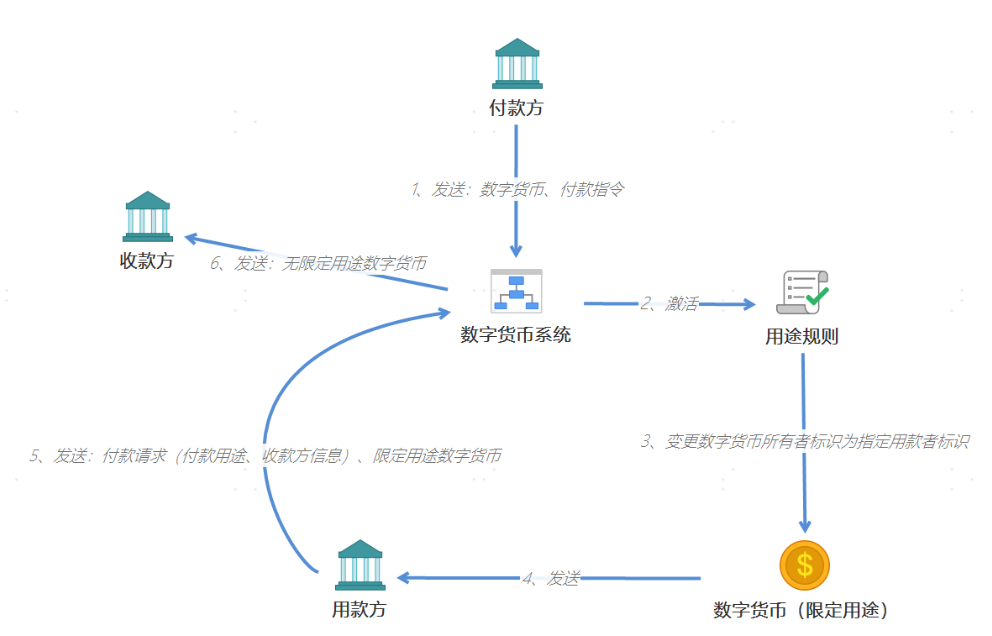

### 法定数字货币的管理

存在4种基于一定条件触发的管理方法和系统：基于经济条件状态、基于贷款利率条件、基于流向主体条件、基于时点条件

#### 1. 基于经济条件状态

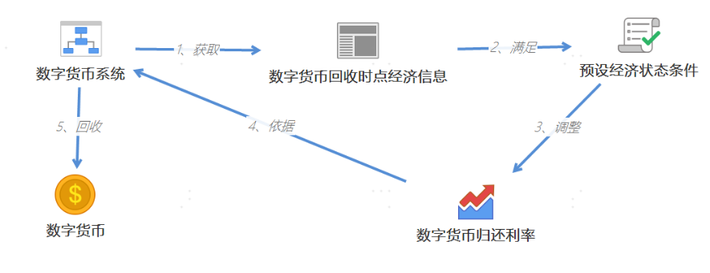

根据当前经济信息，可以逆周期的调整金融机构对数字货币发行单位的资金归还利率，减少贷款行为的顺周期性，实现经济的逆周期调控

#### 2.基于贷款利率

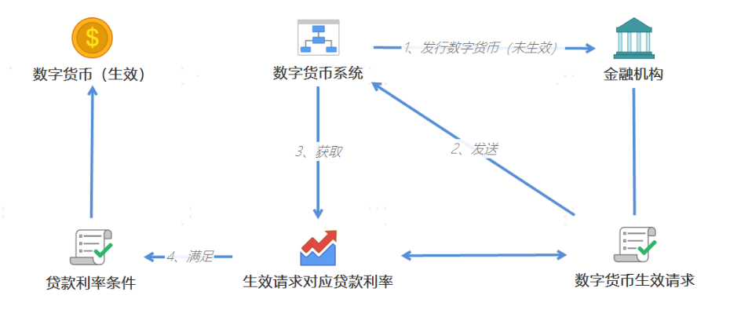

预先申请一些未生效的数字货币，然后设定一个生效贷款利率，一旦触发，这些数字货币就会生效

#### 3.基于流向主体

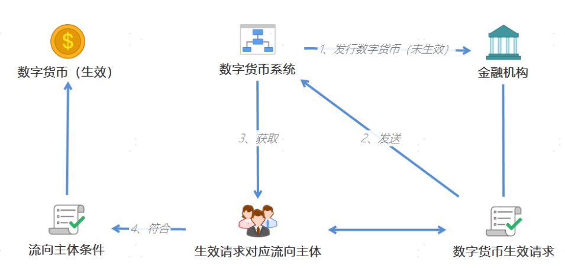

相当于某些数字货币是流向某些特定的主体时，一些数字货币就会生效，然后货币会贬值。那么投资人的融资成本会下降（更低的代价借得到钱），所以会更愿意投资某些领域。

#### 4. 基于时点条件

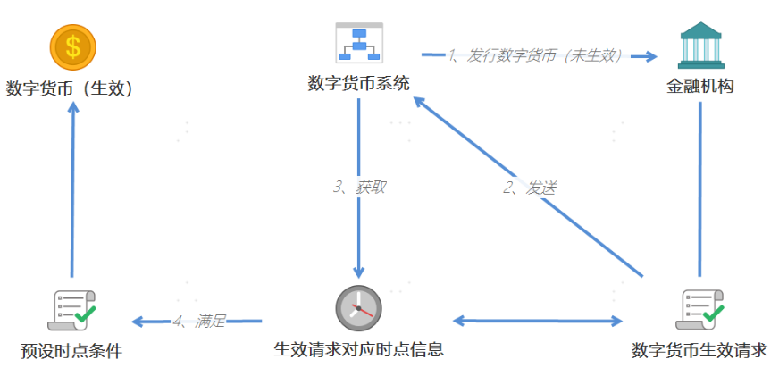

根据预设的时点信息，对数字货币进行激活

#### 追踪流向功能

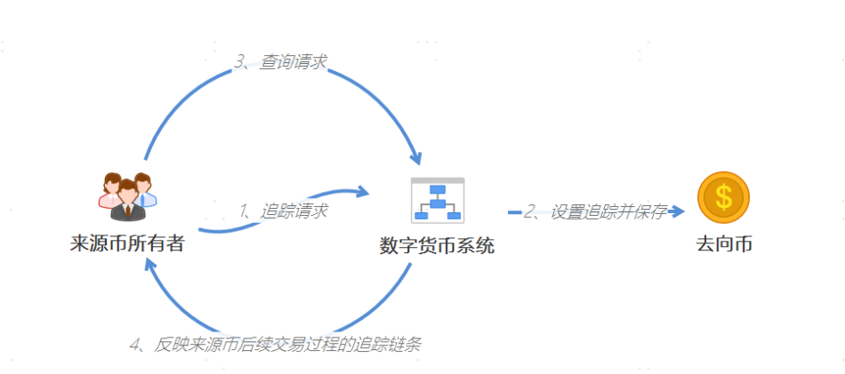

前持币者可以申请进行货币追踪请求，会被设置过滤部分敏感信息，但大致知道后续如何交易

### 法定数字货币的回笼

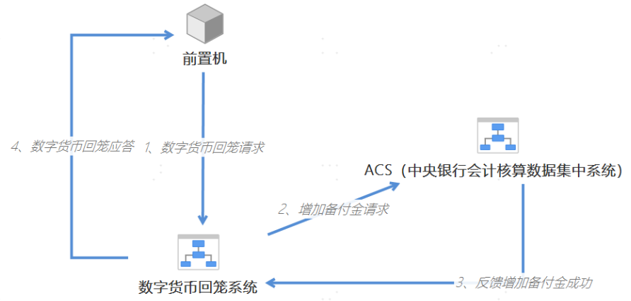

回笼是为了减少市面上的流通货币，避免通货膨胀等情况，稳定经济

### 法定数字货币用于投融资

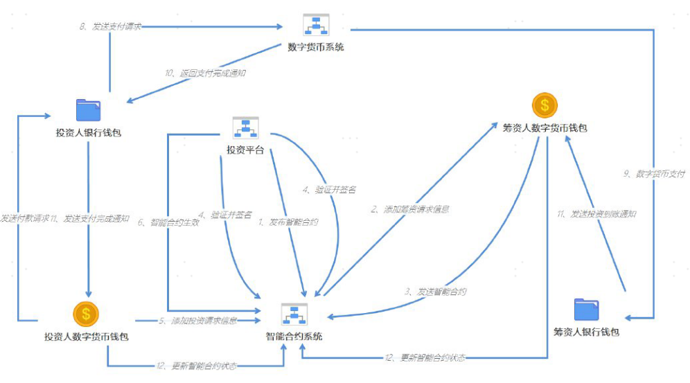

投资人钱包需要接收智能合约，钱包收到投资人提供的投资金额指令后，向智能合约中添加投资确认信息（投资金额、投资人数字签名、投资人个人信息）。投资平台对智能合约中的信息进行了确认后，标记其为生效，这时候投资人钱包根据生效的智能合约，向筹资人钱包支付数字货币。

### 数字货币用于银行间结算

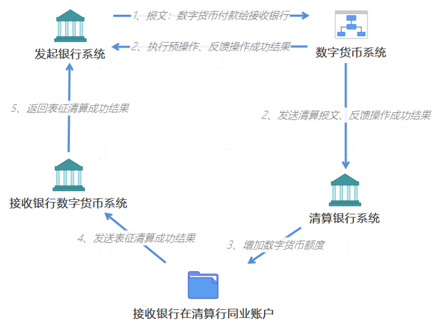

首先清算发起行向数字货币系统发起清算请求，数字货币系统进行预设操作。预设操作完成既向发起行告知预处理完毕，向清算行发起清算请求。随后清算行对收款行的对应账户添加数字货币额度，收款行账户通知收款行数字货币系统。最后数字货币系统向发起行系统通知清算完成。

## 央行法定数字钱包与芯片卡

### 1. 数字货币钱包

数字货币的申请与开通

**1.1. 由账户行的数字货币系统创建的数字货币钱包**

第一种开通方式是：用户使用银行账户与数字钱包进行绑定，开通账户既可访问数字钱包

**1.2. 钱包服务商创建的数字货币钱包**

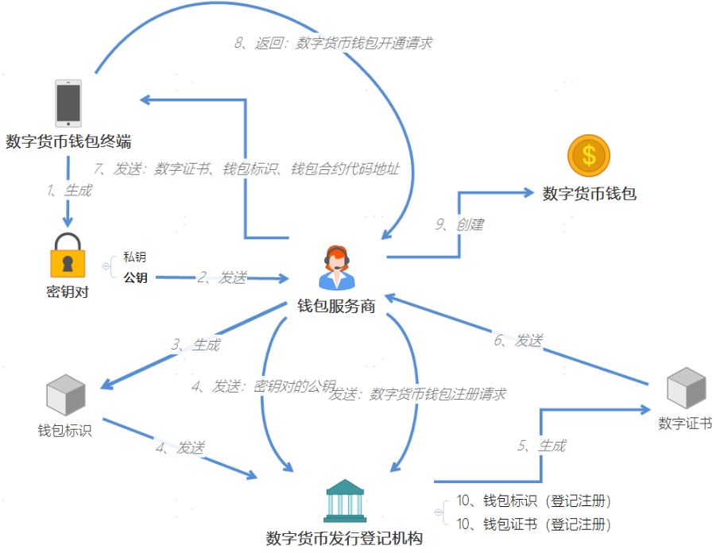

第二种开通方式是通过钱包服务商。数字货币钱包终端生成密钥对，公钥发给钱包服务商。服务商根据接收到的公钥生成钱包标识，并将公钥和钱包标识一同发送给数字货币发行登记机构。机构会根据钱包和公钥生成钱包标识、钱包证书和数字证书。并把数字证书发送回钱包服务商。然后服务商将（数字证书、钱包标识、钱包合约代码地址）发送到用户钱包终端。如果返回终端返回开通请求，既创建数字钱包，同时向数字货币发行机构发送注册请求。数字货币发行机构根据注册请求，对（钱包标识，钱包证书）进行登记注册。

### 2. 数字货币钱包的登录与同步

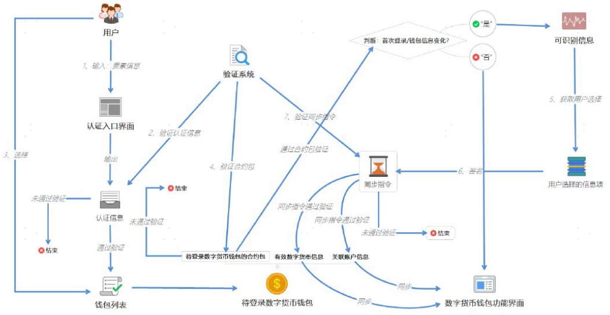

具体登录流程：首先响应用户的登录请求，验证用户认证信息。通过后，获取并验证待登录的数字货币钱包的合约包。合约包验证通过后，用户可以进入到界面。如果用户首次登录钱包，或者钱包相关信息发生了变化，则需要做信息与数据的同步。

同步：首先获取并验证用户的认证信息，认证通过后，对用户可见的信息进行同步，然后获取有效数字货币信息和关联账户信息。

### 3. 数字货币钱包与银行钱包的绑定与解绑

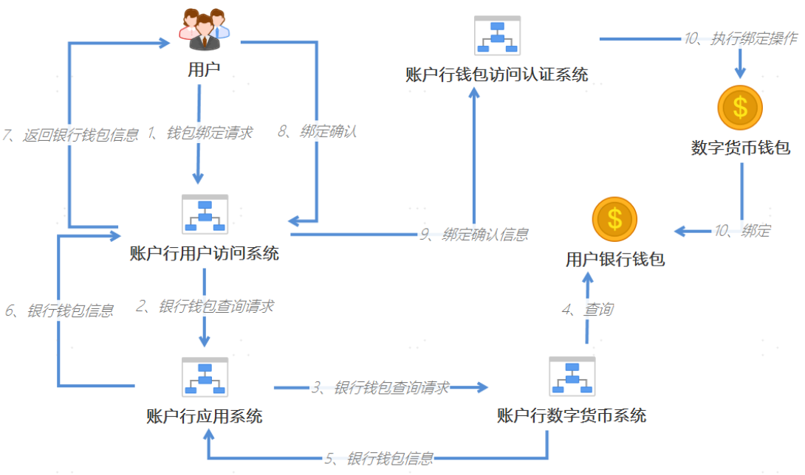

用户将银行钱包与数字货币钱包绑定后，数字货币钱包可以直接访问银行钱包。

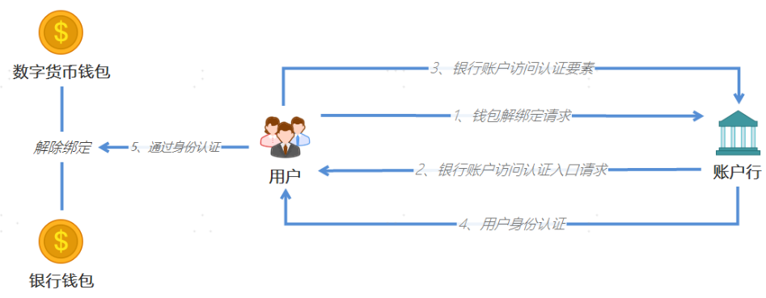

### 4. 数字货币钱包相关的查询操作

能够接收用户发起查询请求的主体有：用户的账户行或数字货币钱包终端

第一种情况，是需要通过账户行的认证系统进行验证，然后由账户行数字货币系统去返回请求

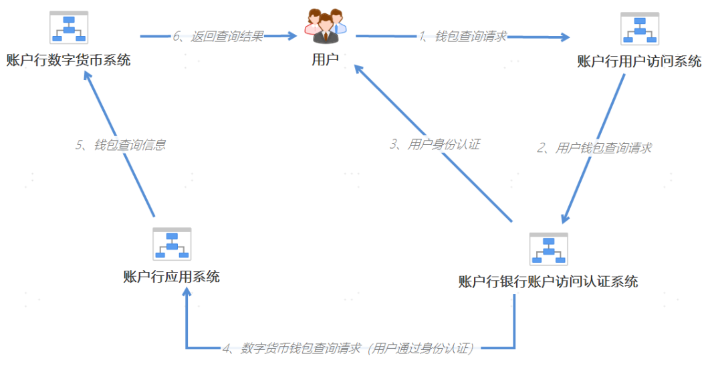

第二种情况，用户可以得到关联账户的信息

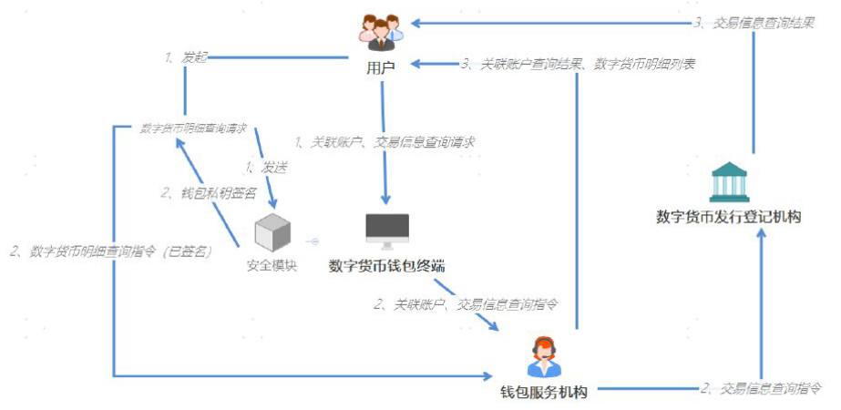

### 5. 基于钱包的数字货币支付、存储和转移

第一种，支付场景下，账户行数字货币系统在接收到数字货币钱包的支付请求之后，获取用户输入的数字货币钱包的CA数字签名，以生成数字货币的转移请求。接着账户行数字货币将数字货币转移请求发送至数字货币发钞行，并接收带有发钞行数字签名的支付成功结果。

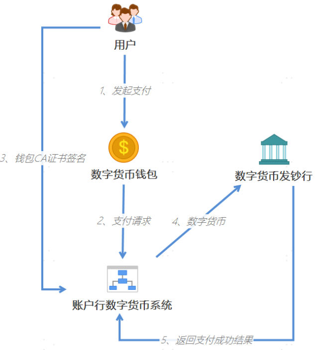

第二种，存储场景下，数字货币钱包终端接收到存币指令之后，为存币指令添加**数字货币保管箱**标识生成**存币转移请求**，并将请求发送至数字货币发行登记端。登记端将来源币串列表作废，生成存入去向币串列表，将转移结果信息发送给数字货币钱包。数字货币钱包将去向币串存入并对用户的账户入账，最后生成存币结果返回。

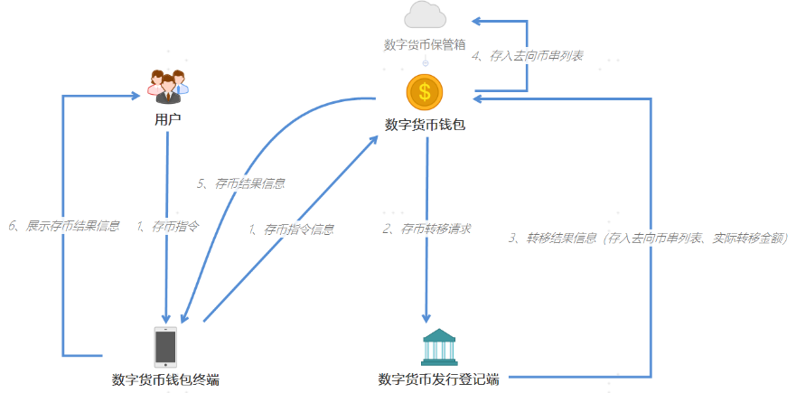

第三种，转币场景下，根据接收方收款地址信息生成转币请求，根据请求生成转币指令，依据转币指令，向接收方钱包执行转币操作。

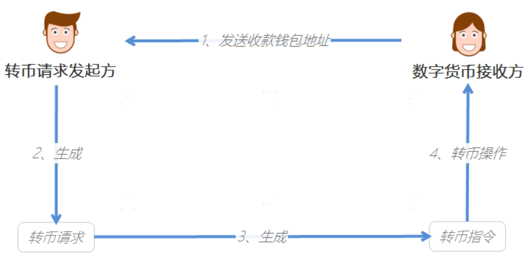

### 6. 数字货币钱包状态的变更：升级、更换秘钥、注销

#### 6.1 升级

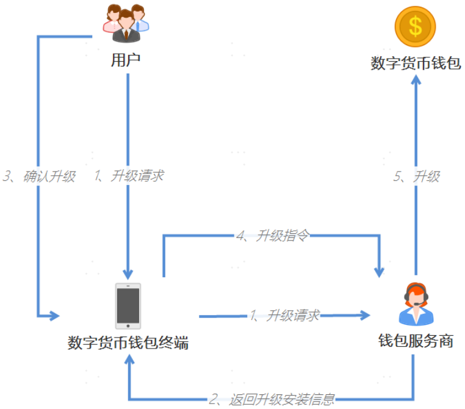

数字货币钱包终端收到升级请求后，向钱包服务商发送升级请求。服务商返回安装信息后，用户确认升级，终端则发送升级指令。最后服务商完成对钱包的升级。

#### 6.2更换秘钥

用户发出更换秘钥请求后，钱包终端首先将当前签名合约退出，再生成新的钱包秘钥对，向数字货币钱包发送新生成的公钥，以及进行签名认证的更换秘钥请求。随后终端会使用**旧的钱包私钥**进行加密一份**待确认更换秘钥指令**给数字货币钱包。收到数字货币钱包发送的待确认换秘钥指令(**同样为旧私钥签名的**)后，更新钱包签名合约包信息，以及更新新合约包绑定的新的钱包秘钥。

#### 6.3注销钱包

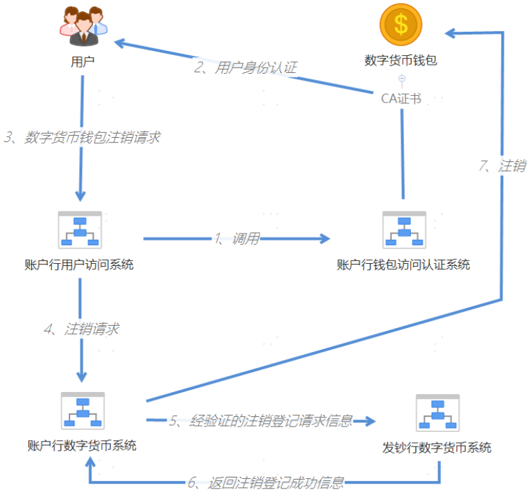

注销具体过程为：账户行用户合法访问系统后，调用账户行钱包访问认证系统，然后使用带有用户数字签名的注销请求信息发送至账户行数字货币系统。然后将验证的注销登记请求信息发送给发钞行数字货币系统进行注销，完成既接收注销成功信息。

### 7. 央行数字货币芯片卡

这种芯片卡可以认为是：专门用于数字货币交易**且**需要终端设备配合（绑定）使用的一种媒介。

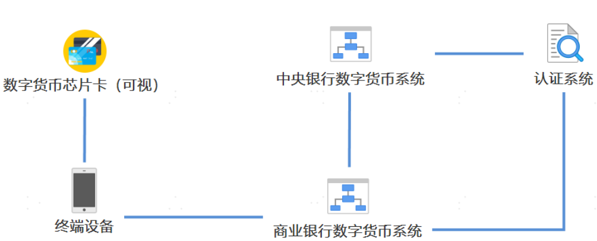

## 央行法定数字货币的使用

### a. 现金兑换数字货币

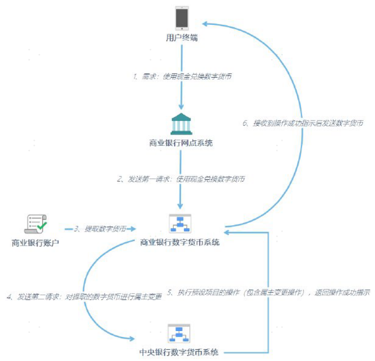

当用户需要将现金兑换成数字货币时，商业银行的网点系统会把这个请求发送给该银行的数字货币系统。该银行数字货币系统首先会从该银行的账户中数字货币提取数字货币，然后再向央行数字货币系统发送第二请求（对提取的数字货币进行属主变更）。变更操作完成后（包括一些预设的规则执行），商业银行的数字货币系统返回操作成功消息返回用户终端。

### b. 数字货币兑换现金

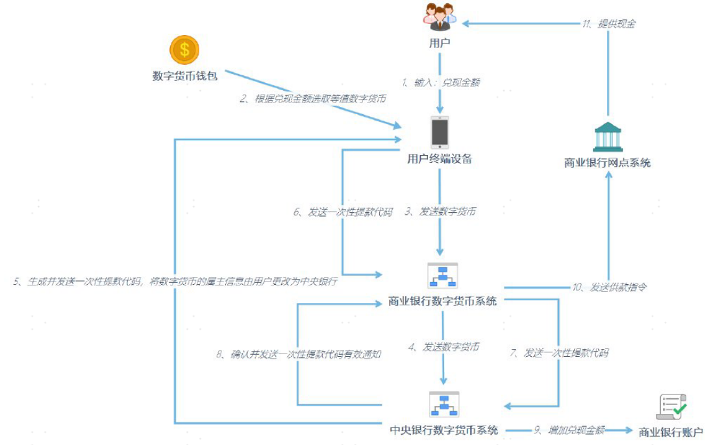

当用户需要将数字货币兑换成现金时，首先向终端输入兑换金额。随后终端将数字货币发送给商业银行数字货币系统，商业银行数字货币系统将转发这个信息到中央银行数字货币系统。央行数字货币系统生成一个一次性提款代码直接给用户终端，并将数字货币的属主信息更改为中央银行。商业银行数字货币系统再次转发用户收到的一次性提款代码，央行确认提款代码有效后直接给商业银行账户打钱，后面即为供款成功。

###  c. **使用数字货币进行支付**

#### c1. 终端设备间的支付

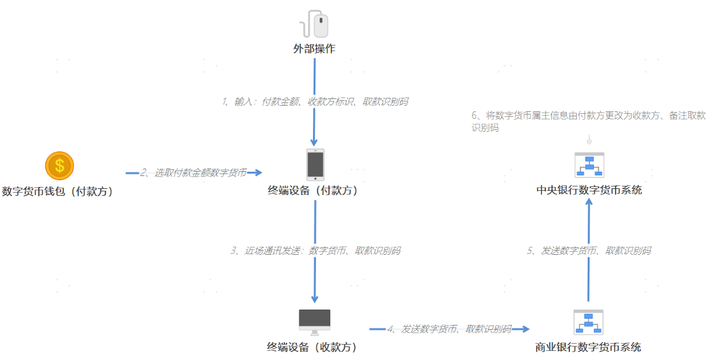

在线下支付场景中的流程为：付款方输入1) 付款金额，2) 收款方标识，3) 取款识别码之后，付款方设备在付款方数字货币钱包内选取总金额等于付款金额的数字货币。随后付款方终端设备将 1) 数字货币 和 2) 取款识别码，以近场通信方式发送给**收款方标识**所对应的**收款方终端设备**。收款方终端设备通过网络，将这两个东西发送到商业银行的数字货币系统，商业银行数字货币系统再把这两个转发给央行数字货币系统。最后，央行数字货币系统将数字货币的属主信息有付款方转为收款方，并备注其取款识别码。

#### c2. 商业银行数字货币系统撮合下的数字货币支付

 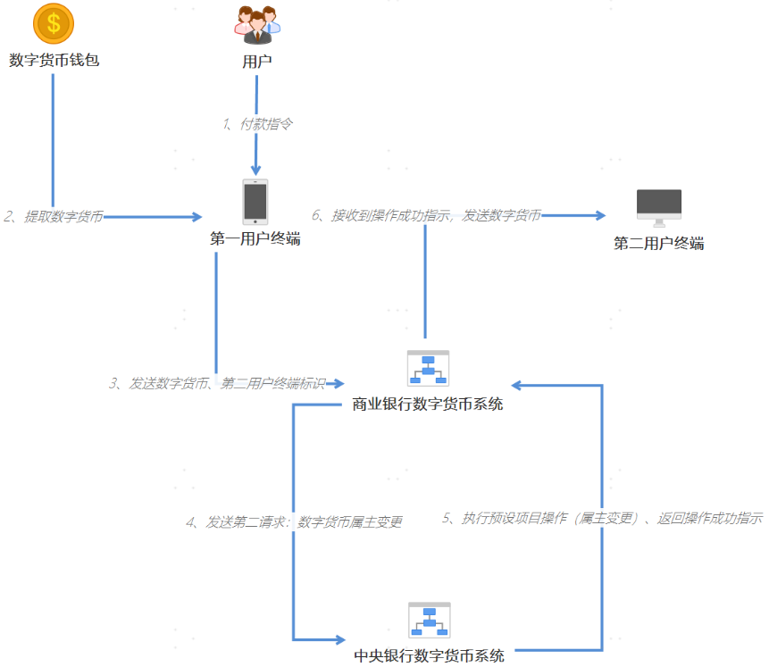

支付场景不支持终端设备之间直接接触时，就需要商业银行数字货币系统中间支持，具体过程为：第一用户终端根据付款指令，从数字货币钱包提取与所指定金额相等的数字货币，并生成第一请求发送给商业银行数字货币系统。（第一请求包括：1) 第二用户终端标识 2) 数字货币 ）商业银行系统受到请求后，**生成第二请求**，并转发给央行数字货币系统。央行数字货币系统根据第二请求，执行预设项目操作（包括变更数字货币属主），并返回成功标识给商业银行数字货币系统。商业银行数字货币系统把数字货币转发给第二用户终端。

### d. 数字货币在银行的存储

用户可以在不需要使用数字货币的时候将其存储在用户的数字货币存款账户中，将数字货币存入存款账户的过程为：

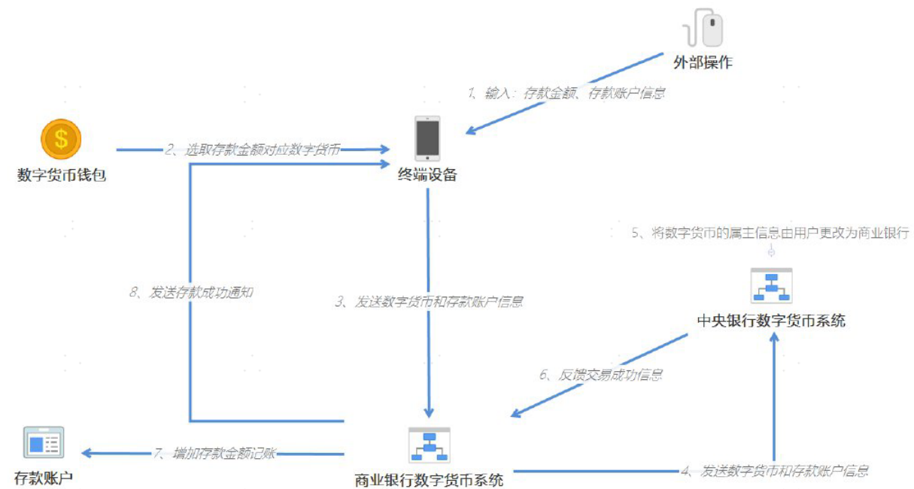

终端设备接收输入的存款金额，存款账户信息。终端设备在数字货币钱包选择等量金额，然后将数字货币与存款账户信息一并发送到存款行的数字货币系统。随后商业银行数字货币系统将数字货币与存款账户信息转发给央行数字货币系统。央行数字货币系统会将数字货币的属主信息更改为商业银行，并反馈成功信息。商业银行数字货币系统根据交易成功信息，为对应存款账户增加存款金额记录。

## 央行法定数字货币与区块链技术

### 1.  区块链用于数字货币钱包地址的管理

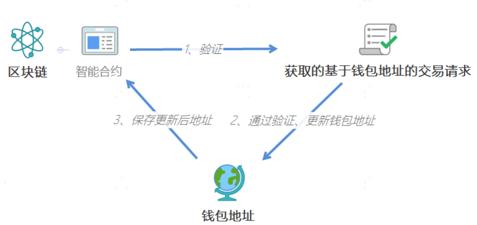

通过智能合约对交易方基于钱包地址发起的交易请求进行验证之后，若确定验证通过，则对钱包地址进行更新并保存至智能合约。这样后续交易可以基于新的钱包地址来进行下一轮交易。由于对原钱包地址与交易方的真实身份信息之间的绑定关系被强制切断，因此即便外界追踪到了原钱包地址，也无法通过该原钱包地址查看到与交易方的真实身份信息对应的隐私，有效保护用户隐私。

### 2. 区块链用于交易信息监管

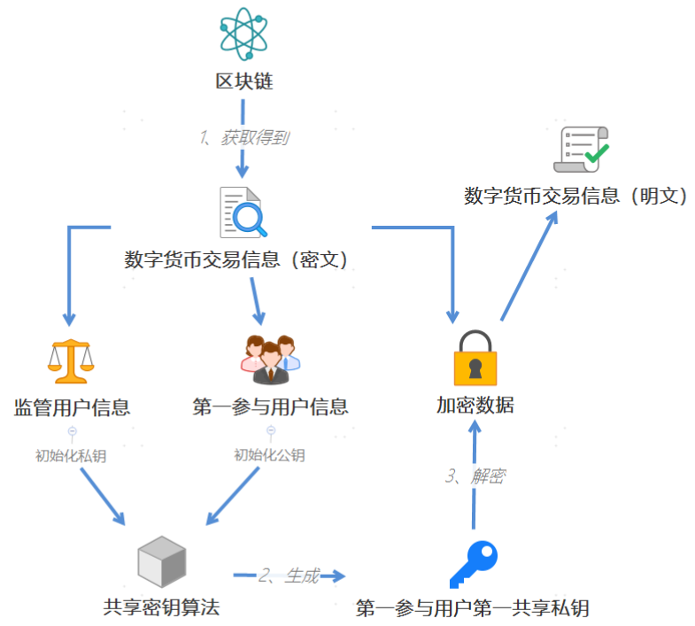

监管方法包括：从区块链中获取数字货币信息，交易信息（包括将用户信息，第一参与用户信息，加密数据）。加密数据是：根据第一参与用户的初始化公钥及监管用户的初始化私钥，利用共享秘钥算法生成第一参与用户的第一共享私钥。然后利用第一共享私钥解密加密数据，得到监管用户与第一参与用户的数字货币交易明文，可以实现交易信息对区块链上无关第三方的保密。

### 3. 基于区块链和数字货币的数字票据交易

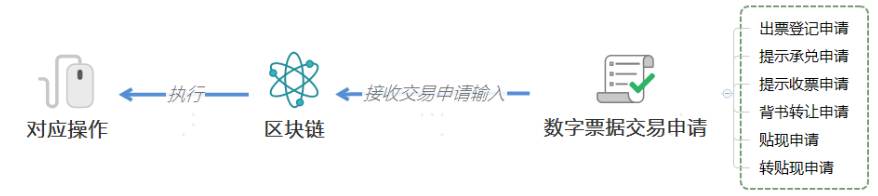

首先由区块链接收输入的数字票据交易申请，其中，数字票据交易申请包括出票登记申请等，接着区块链会执行数字票据交易申请对应的操作。该方法能够在区块链基础上实现票据交易，同时使用数字货币进行票据交易。
