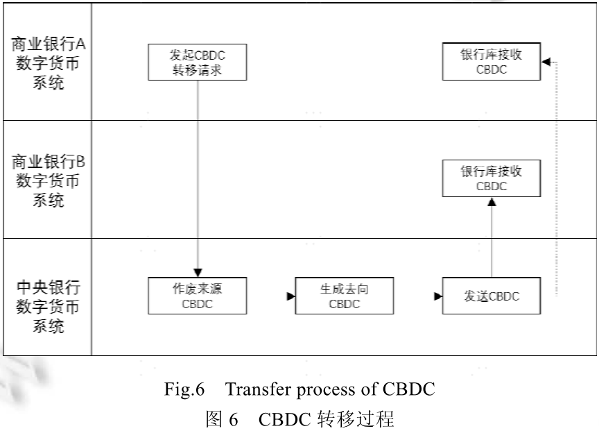

# 中央银行数字货币原型系统实验研究（读后总结）

## 总体框架

由中央银行将数字货币发行至商业银行业务库，商业银行受央行委托向公众提供数字货币存取等服务。

## 关键要素：一币二库三中心

- 一币：CBDC，由央行担保并签名发行的**代表具体金额**的**加密数字串**。
- 二库：中央银行发行库，商业银行的银行库，同时包括流通市场上个人和单位使用的CBDC数字钱包。
- 三中心：认证中心，登记中心，大数据分析中心。
  - 认证中心：央行数字货币机构 + 用户身份信息的**集中管理**，是**可控匿名**的重要环节。
  - 登记中心：记录**CBDC及其对应用户身份**，以完成**权属登记**。并**记录流水**，完成CBDC**产生，流通，清点核对，消亡**全流程登记。（扩展上是允许网上确权查询服务的）
  - 大数据中心：反洗钱，支付行为分析，监管调控指标分析等。

## 运行机制

### CBDC表达

CBDC形式上就是一串经过加密的字符串，CBDC表达式本质上是对**货币制度主要构成要素**及**权属**的**加密处理**，是CBDC系统安全运转的基础。

CBDC模型中包含了：

- 发行方
- 发行金额
- 流通要求
- 时间约束
- 甚至智能合约。。。

### CBDC的模型化表达式

$EXP_{CBDC}=Sign\left(Crypto\left(ATTR\right)\right)$

$ATTR\in\{id,value,owner,issuer,ExtSet\}$

其中$EXP_{CBDC}$代表CBDC的表达式，而$ATTR$是表达式包括的属性。可以看出，CBDC加密串首先是对所有属性进行**加密**，然后再整个进行**签名**。属性集合包括，**用户标识**id，**币串面值**value，**所有者信息**owner，**发行方信息**issuer，**可扩展属性集合**ExtSet。

### CBDC基本结构

其中**编号**是CBDC的**唯一标识UUID**，也是被当作索引使用。**金额**代表面值，可被拆分到最小粒度是**0.01元**，也就是1分。

## 发行回笼机制

- CBDC发行：是指**央行生产所有者为某个商业银行的CBDC**，并发送到商业银行的过程。

- CBDC回笼：是指**商业银行缴存CBDC，中央银行将CBDC作废**的过程。

为保证发行和回笼不改变中央银行货币发行总量，商业银行存款准备金与CBDC等额兑换的机制可以很好的预防，而其中会计审核会由央行会计核算系统来处理。

发行阶段，扣减商业银行存款准备金，等额发行CBDC。

回笼阶段，作废CBDC后，等额增加商业银行存款准备金。

## 转移机制

在运行机制中描述了CBDC表达式中包含一个关键信息**所有者**，所以CBDC的转移必然会涉及到**加密字符串的转换**，分为**来源币**和**去向币**。来源币既转移之前的CBDC，去向币既经过来源币作废之后，新生成的CBDC。CBDC的转移可以有以下几种模式：**直接转移**，**合并转移**，**拆分转移**。

- 直接转移：币串金额不发生改变，只改变所有者（以及签名等信息）
- 合并转移：多个币串（同一个所属者），合并生成的新币串，除了所有者改变，金额也会变为前面多个输入币串的汇总金额。
- 拆分转移：一个大面额币串，新生成多个币串，其中一个与原有所有者一致，但金额不一致。

CBDC字串转移是指将代表CBDC的加密字符串以**数据包**的形式在发送方和接收方保管CBDC的系统之间进行传输。

经实操验证，两次兑换数字人民币，获得的是两个币串。

而**商业银行中的币串转移**，目前**都是通过中央银行数字货币系统**进行转换并传递的过程。

## 总体架构

## 系统架构

## CBDC转移具体过程

