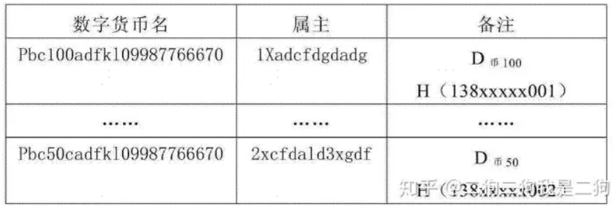
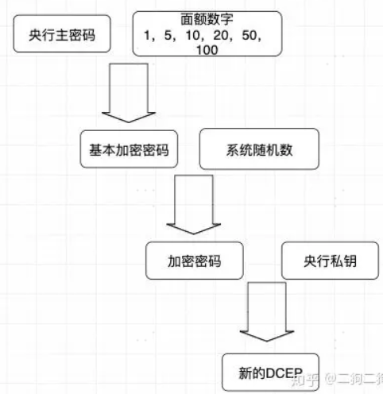

# UTXO

UTXO全称为Unspent Transaction Output，是指**未花费的支出**。如果要算一个人拥有的BTC总资产，需要计算他的比特币地址的所有UTXO才能计算得出，这一点与钱包和真实货币的概念类似。但不同点在于UTXO是没有固定面值的概念。

其中UTXO的交易方式为：比如买家发送6个价值为1BTC的UTXO给卖家，卖家收取5.8BTC并返回0.2BTC给买家。这中间的情况就是，6个BTC被**销毁**，然后两个价值分别为0.2BTC和5.8BTC的UTXO被**新生成**。

重点：**交易UTXO的时候是以UTXO为单位的，即为整数倍的UTXO，不存在说我又1BTC的UTXO然后只用0.5个这种情况**

# 央行DCEP系统的核心要素

## **一币**

一种数字货币，相当于只有使用央行私钥签名的数字货币才被承认，而每个人的数字钱包都内置央行的公钥，来验证发行方。

## 二库

两种数据库。一个央行发行库，央行发行的数字货币首先存放在这个发行库，商业银行需要兑换时则从这个库获取。另一个是商业银行数字货币库，而用户可以从这个货币库存入到电子数字钱包，这一阶段属于流通环节。

## 三中心

三中心分两种，一个登记中心，一个认证中心。

登记中心负责管理整个生命周期，包含货币生成、转移、销毁、回笼。里面主要包含两张表：**数字货币权属登记表**，**交易流水表**。权属登记表是记录某面额的数字货币是属于谁的，每当数字货币发生了转移，在央行的登记中心都会对对应的数字货币**属主**信息更改，通过该表可以实现确权查询。重点：**登记中心可以确定用户有多少钱**。

认证中心分两类，CA认证和IBC认证。CA通常是高级机构认证，而IBC则是用于个人的。

引入认证中心的原因是：当用户或机构发起一起DCEP转账，需要通过自己的私钥进行签名，所以一笔交易的合法性是由签名来保证的。其他数字货币如(Libra，Ethereum等)，私钥都是用户自己创建的，由自己保管，并且用户的地址是由私钥对应的公钥通过一系列运算得到的，资产归属与私钥是天然绑定的。但由于央行需要对DCEP进行监管，**资产归属**和**私钥**是分开的。央行会在用户注册了一个DCEP钱包后，通过**认证中心**为用户**分配一个私钥**，并用这个私钥来证明该用户，所以用户是否拥有某些数字货币就找登记中心确认。重点：**私钥是央行生成然后分发给用户的**。

IBC是基于身份标识的密码系统，非对称加密。与CA不同在于没有证书，而是使用用户的手机号、邮箱等作为标识生成**公钥**，再由IBC根据这些标识生成对应**私钥**，分配给用户。由于用户标志本身就是公钥，也就不需要依赖证书和证书管理系统。此时央行的公钥，用户的私钥，证书数据就比较重要。

## DCEP印刷过程

