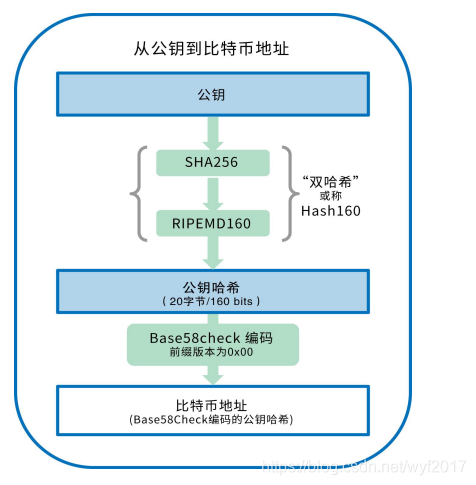
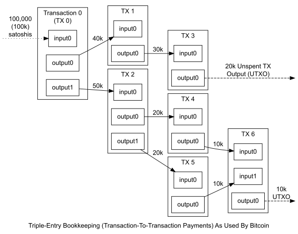
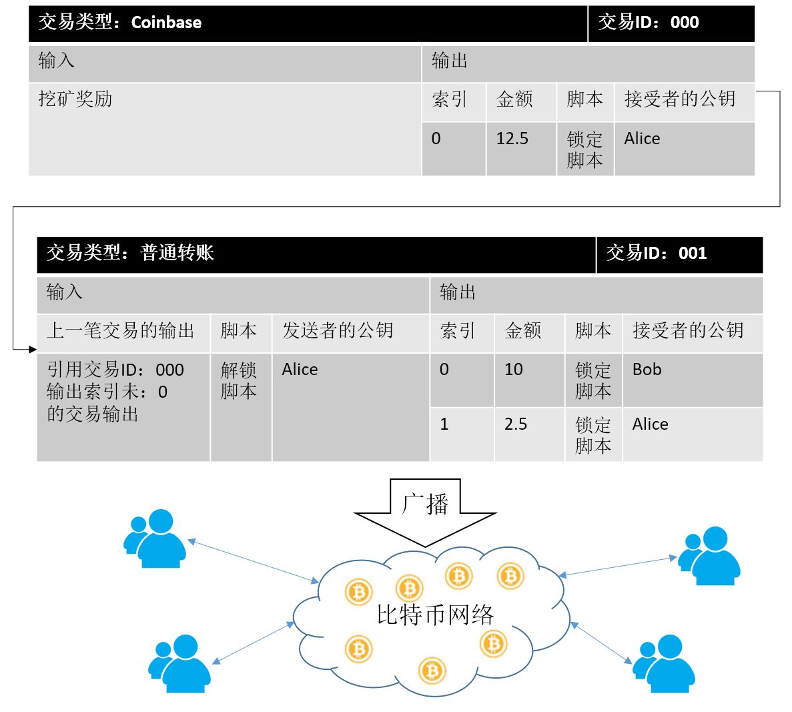

# 转账资金流对比

## 微信转账

费用在资金流转入转出中

## 比特币转账

(https://my.oschina.net/u/4366189/blog/4535442)

### 创建账户

比特币中的账户是匿名的，这是因为创建时是用非对称加密算法创建一对公私钥。首先，私钥是随机一个32字节的数出来，然后再使用椭圆曲线加密算法，将私钥**压缩**成公钥，这里是不可逆的。而**钱包地址**，又是通过公钥的一系列转换得到的，也是不可逆的。

这里的BTC地址，可以理解为公钥的摘要。（因为主要是hash）

### 发起交易

而一笔BTC交易，付款人会发送这样一个报文：

> {	付款地址 ：address - A
>
> ​	收款地址 ：address - B
>
> ​	金额 ：5.2 BTC	}

实际发送报文之前，付款方还会使用其私钥对hash过的报文进行签名：

> 1. 对报文进行hash获取摘要信息
>
>    ​	summary = hash({ 付款地址 ：address - A 收款地址 ：address - B 金额 ：5.2 BTC })
>
>    => "KrDsjT4J7vo6GbibMQMPYkcA2f5bck"
>
> 2. 对摘要信息使用付款方的私钥进行签名
>
>    ​	signature = sign(summary, private-key-A) -> "RAJ8uRurwWQVQRO5"

实际上，一个BTC交易报文应该包含：

- 付款方signature
- 付款方的资金来源的交易Id（上一个入账区块的Id）
- 交易金额
- 收款人地址
- 收款人公钥
- 时间戳

### 交易验证

通常就是把报文信息summary一下，然后用交易付款方的公钥对signature解密一下，对比两者是否相同。相同的情况下，还会检查付款地址的BTC是否足够（这里会遍历付款人的**所有交易**，以确认他拥有足够的BTC进行这一笔交易）。

UTXO示意图，每一笔交易都能被追溯来源

交易完整图示：(https://blog.csdn.net/wen294299195/article/details/80220651)

费用主要是支付给矿工帮忙塞入区块的矿工费

## 数字人民币

两种形式：

1. 现在大量试点的在线模式（还是有中间费用）：通过二维码，与原有收发单逻辑类似，银行间自行进行转账的形式
2. 离线转账，央行个人数字钱包模式（这种转账将不在有中间商，理论上转账将不会再有任何费用）

