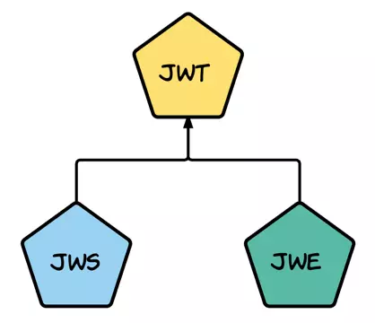
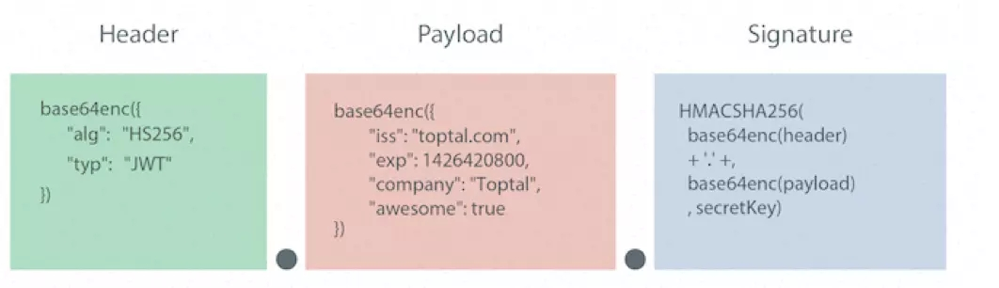

# JSON Web Token 概要

基于OAuth2的单点登录模式，催生了Token Auth机制的发展。目前JSON Web Token是最热门的Token Auth认证实现。

## Json Web Token (JWT)

是一种轻巧的规范，JWS和JWE分别是JWT的一种实现方式。



## 什么是JWT

> ```
> eyJhbGciOiJIUzI1NiIsInR5cCI6IkpXVCJ9.
> eyJzdWIiOiIxMjM0NTY3ODkwIiwibmFtZSI6IkpvaG4gRG9lIiwiYWRtaW4iOnRydWV9.
> TJVA95OrM7E2cBab30RMHrHDcEfxjoYZgeFONFh7HgQ
> ```

这个就是一个 JWT (实际上是JWS)

## JWT解决了什么问题

JWT主要目的是在服务端和客户端之间以安全的方式来转移声明：

- 认证：Authentication
- 授权：Authorization
- 联合识别
- 客户端会话（stateless）
- 客户端机密

### JWT名词

1. JWS：Signed JWT，完成签名的JWT
2. JWE：Encrypted JWT，payload经过加密的JWT
3. JWK：JWT的密钥
4. JWKset：非对称加密的密钥对
5. JWA：当前JWT所用到的密码学算法
6. nonsecure JWT：当头部的签名算法被设定为none时，JWT是不安全的


## JWT的组成

通常一个JWT的组成是：

1. Header：声明了JWT的签名算法
2. Payload：承载了各种声明并传递**明文**数据
3. signature：拥有该部分的JWT被命名为JWS

三个部分分别用.来隔开，形如：xxxxxxxx.yyyyyyy.zzzzzz

### JWT Header

> ```json
> {
>   "typ": "JWT",
>   "alg": "none",
>   "jti": "4f1g23a12aa"
> }
> ```

头部通常由两部分组成：令牌类型（JWT还是JWS）和 使用的非对称加密算法。Jti则是JWT ID，代表JWT编号，在服务器端唯一。

### JWT PayLoad

加密方式：

> ```
> base64UrlEncode(header)
> >> eyJ0eXAiOiJKV1QiLCJhbGciOiJub25lIiwianRpIjoiNGYxZzIzYTEyYWEifQ
> ```

解密后：
> ```json
> {
>   "iss": "http://shaobaobaoer.cn",
>   "aud": "http://shaobaobaoer.cn/webtest/jwt_auth/",
>   "jti": "4f1g23a12aa",
>   "iat": 1534070547,
>   "nbf": 1534070607,
>   "exp": 1534074147,
>   "uid": 1,
>   "data": {
>     "uname": "shaobao",
>     "uEmail": "shaobaobaoer@126.com",
>     "uID": "0xA0",
>     "uGroup": "guest"
>   }
> }
> ```

payload通常由3个部分组成：Registered Claims，Public Claims，Private Claims。

#### Registered Claims

| 缩写 | 全称         | 解释                                |
| ---- | ------------ | ----------------------------------- |
| iss  | [issure]     | 发布者URL地址                       |
| sub  | [subject]    | 该JWT所面向的用户，用于处理特定应用 |
| aud  | [audience]   | 接收者的URL地址                     |
| exp  | [expiration] | 该JWT的销毁时间，Unix时间戳         |
| nbf  | [not before] | 该JWT的使用时间不能早于，Unix时间戳 |
| iat  | [issued at]  | 该JWT的发布时间，Unix时间戳         |
| jti  | [JWT ID]     | 该JWT的唯一ID编号                   |

JWT payload加密算法

与Header的加密方式类似

```
base64UrlEncode(payload)
>> eyJpc3MiOiJodHRwOi8vc2hhb2Jhb2Jhb2VyLmNuIiwiYXVkIjoiaHR0cDovL3NoYW9iYW9iYW9lci5jbi93ZWJ0ZXN0L2p3dF9hdXRoLyIsImp0aSI6IjRmMWcyM2ExMmFhIiwiaWF0IjoxNTM0MDcwNTQ3LCJuYmYiOjE1MzQwNzA2MDcsImV4cCI6MTUzNDA3NDE0NywidWlkIjoxLCJkYXRhIjp7InVuYW1lIjoic2hhb2JhbyIsInVFbWFpbCI6InNoYW9iYW9iYW9lckAxMjYuY29tIiwidUlEIjoiMHhBMCIsInVHcm91cCI6Imd1ZXN0In19
```


## JWS的概念

是在JWT的基础上，头部声明签名算法，最后尾部添加上签名。




## JWE的概念

|          | JWS     | JWE     |
| -------- | ------- | ------- |
| producer | pri_key | pub_key |
| consumer | pub_key | pri_key |

### JWE构成

```
eyJhbGciOiJSU0ExXzUiLCJlbmMiOiJBMTI4Q0JDLUhTMjU2In0.
UGhIOguC7IuEvf_NPVaXsGMoLOmwvc1GyqlIKOK1nN94nHPoltGRhWhw7Zx0-kFm1NJn8LE9XShH59_
i8J0PH5ZZyNfGy2xGdULU7sHNF6Gp2vPLgNZ__deLKxGHZ7PcHALUzoOegEI-8E66jX2E4zyJKxYxzZIItRzC5hlRirb6Y5Cl_p-ko3YvkkysZIFNPccxRU7qve1WYPxqbb2Yw8kZqa2rMWI5ng8Otv
zlV7elprCbuPhcCdZ6XDP0_F8rkXds2vE4X-ncOIM8hAYHHi29NX0mcKiRaD0-D-ljQTPcFPgwCp6X-nZZd9OHBv-B3oWh2TbqmScqXMR4gp_A.
AxY8DCtDaGlsbGljb3RoZQ.
KDlTtXchhZTGufMYmOYGS4HffxPSUrfmqCHXaI9wOGY.
9hH0vgRfYgPnAHOd8stkvw
```

JWE一共5个部分，分别是：

- The protected header，类似JWS的头部
- The encrypted key，用于加密密文和其他加密数据的**对称密钥**
- The initialization vector，初始IV值，有些加密方式需要额外的或随机的数据
- The encrypted data（cipher text），密文数据
- The authentication tag，算法产生的附加数据，防止密文被篡改

### JWE密钥加密算法

一般来说，JWE需要对密钥进行加密，这意味着一个JWE中至少有两种加密算法在起作用。但并非将密钥拿来就能用，我们需要对密钥进行加密后，利用JWK密钥管理模式来到导出这些密钥。JWE有5种管理模式：

1. Key Encryption
2. Key Wrapping
3. Direct Key Agreement
4. Key Agreement with Key Wrapping
5. Direct Encryption

### JWE Header

> type：一般是 jwt
>
> alg：算法名称，和JWS相同，该算法用于加密稍后用于加密内容的实际密钥
>
> enc：算法名称，用上一步生成的密钥加密内容的算法。
>
> zip：加密前压缩数据的算法。该参数可选，如果不存在则不执行压缩，通常的值为 DEF，也就是[deflate算法](https://tools.ietf.org/html/rfc1951)
>
> jku/jkw/kid/x5u/x5c/x5t/x5t#S256/typ/cty/crit：和JWS额额外声明一样。

### JWE的加密过程

1. 首先根据头部alg的声明，生成一定大小的随机数
2. 根据密钥管理模式，确定加密密钥
3. 根据密钥管理模式确定JWE加密密钥，得到CEK
4. 计算初始IV（若不需要则跳过该步骤）
5. 如果ZIP在头部声明了，则压缩明文
6. 使用CEK，IV和附加认证数据，通过enc头声明的算法来加密内容，结果为加密数据和认证标记
7. 压缩内容，返回token

> ```
> base64(header) + '.' +
> 
> base64(encryptedKey) + '.' + // Steps 2 and 3
> 
> base64(initializationVector) + '.' + // Step 4
> 
> base64(ciphertext) + '.' + // Step 6
> 
> base64(authenticationTag) // Step 6
> ```

### 多重验证与JWE序列化

> ```json
> {
>     "protected": "eyJlbmMiOiJBMTI4Q0JDLUhTMjU2In0",
>     "unprotected": { "jku":"https://server.example.com/keys.jwks" },
>     "recipients":[
>         {
>         "header": { "alg":"RSA1_5","kid":"2011-04-29" },
>         "encrypted_key":
>         "UGhIOguC7Iu...cqXMR4gp_A"
>         },
>         {
>         "header": { "alg":"A128KW","kid":"7" },
>         "encrypted_key": "6KB707dM9YTIgH...9locizkDTHzBC2IlrT1oOQ"
>         }
>     ],
>     "iv": "AxY8DCtDaGlsbGljb3RoZQ",
>     "ciphertext": "KDlTtXchhZTGufMYmOYGS4HffxPSUrfmqCHXaI9wOGY",
>     "tag": "Mz-VPPyU4RlcuYv1IwIvzw"
> }
> ```

结构可以理解为：

> protected：之前的头部声明，利用b64uri加密；
>
> unprotected：一般放JWS的额外声明，这段内容不会被b64加密；
>
> iv：64加密后的iv参数；
>
> add：额外认证数据；
>
> ciphertext：b64加密后的加密数据；
>
> recipients：b64加密后的认证标志-加密链，这是一个数组，每个数组中包含了两个信息；
>
> header：主要是声明当前密钥的算法；
>
> encrypted_key：JWE加密密钥。

