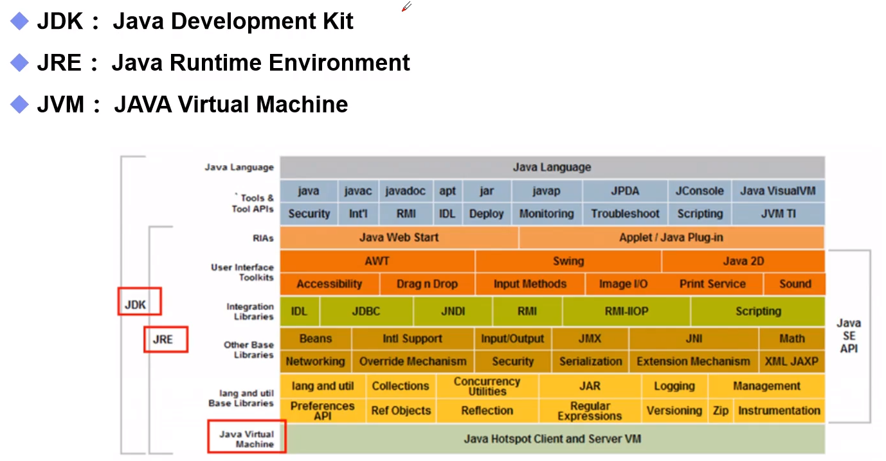

# Java 基础


## Jdk, jre, jvm



JDK包含JRE，而JRE又包含JVM。


## Java注释

> // 单行注释
>
> /**/ 多行注释
>
> /**
>
> */ javadoc注释


## Java进制

```java
int i_0 = 10;		// 十进制（10）
int i_1 = 010;		// 八进制（8）
int i_2 = 0x10;		// 十六进制（16）
```


## Java数据类型

```java
float d1 = 213131313131313f;
float d2 = d1 + 1;
System.out.println(d1 == d2); // 我们将获得True
```

对于float类型，都是接近，但不等于。

**最好完全避免浮点数进行比较**

> 银行业务如何进行比较？
>
> 使用BigDecimal进行比较。（比较且不能有误差）


## Java强制转换

```java
int money = 1_000_000_000;
int years = 20;

long total_1 = money * years;			// 会出现溢出，即使total_1是long类型，money * years时已溢出，得到负数
long total_2 = money * ((long) years);	// 这样就可以得到long下不溢出的结果
```


## JavaDoc生成文件

```shell
javadoc -encoding UTF-8 -charset UTF-8 Doc.java
```


# 网络编程

## 端口

端口表示计算机上的一个程序的进程：

- 不同的进程有不同的端口号，可用来区分软件
- 被规定为0~65535（$2^{16}$），因为在tcp，udp协议头部有16位来存储端口
- TCP, UDP：各有65535个端口，单个协议下，端口不能冲突

> 端口分类
>
> - 公有端口：0 - 1023
>
>   - HTTP：80，HTTPS：443，FTP：21，Telnet：23
>
> - 程序注册端口：1024 - 49151
>
>   - Tomcat：8080，MySql：3306，Oracle：1521
>
> - 动态，私有：49152 - 65534
>
>   - ```bash
>     netstat -ano 					# 查看所有端口
>     netstat -ano|findstr "5900" 	# 查看指定端口
>     tasklist|findstr "8696" 		# 查看指定端口的进程
>     ```


## 网络协议

### TCP

- 三次握手

- 四次挥手

  > - A：我要走了
  > - B：你要走吗？
  > - B：你真的走了吗？
  > - A：我真的走了


### Socket 编程步骤

客户端：

- 连接服务器Server
- 发送消息

服务器：

- 建立服务端口ServerSocket
- 等待用户的连接accept
- 接受用户消息


### UDP

只需要对方地址即可。


### URL

统一资源定位符：

> 协议://ip地址:端口/项目名/资源


