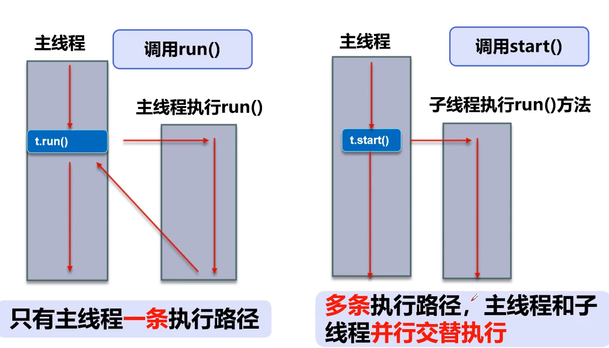
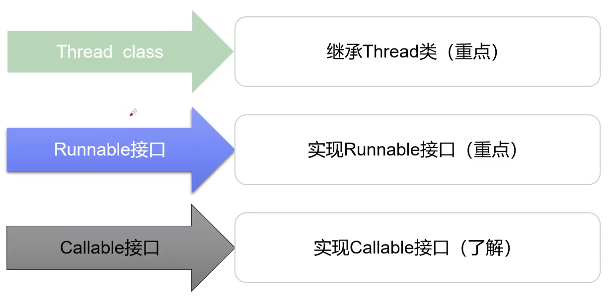
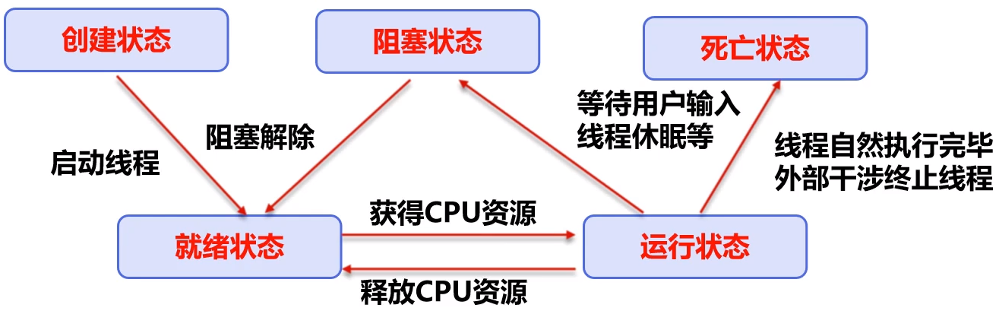
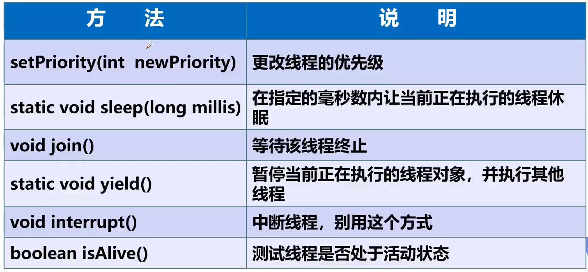
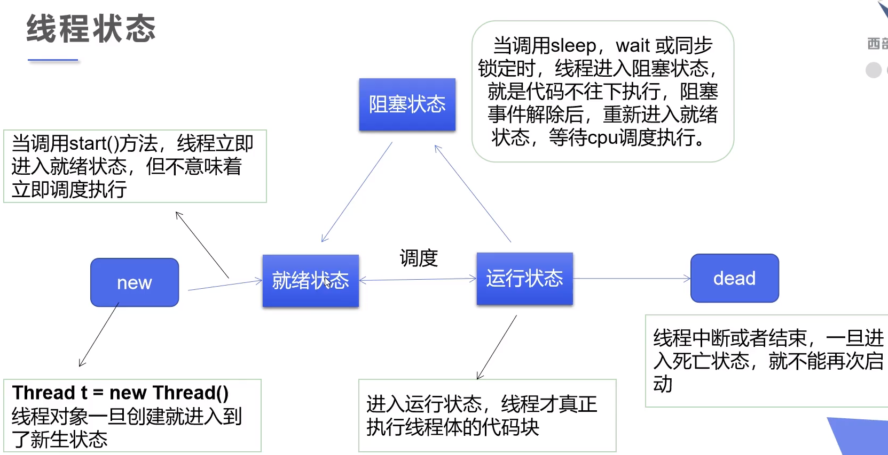

# 多线程




- **普通调用就是使用run方法，是按顺序的执行。**

- **而使用start则是多线程，并发交替的执行。**


## 线程的创建方式




### Thread

实现多线程步骤：

- 自定义线程类继承Thread
- 重写run方法，编写线程执行体
- 创建线程对象，调用start方法启动线程


### Runnable 接口

实现多线程步骤

- 定义线程类实现Runnable方法
- 实现run方法，编写线程执行体
- 创建线程对象（同样需要new Thread），调用start方法启动线程


**Thread 不建议使用，因为具有单继承局限性**


### Callable接口

实现方法与runnable类似，需要实现一个call方法

- 最大不同是call方法是有返回值的
- 另外实现runnable类之后，直接注入创建线程之后start就可以执行。但是callable需要创建执行服务，然后提交执行，才是开始多线程实现。

好处：1. 可以有返回值 2. 可以抛出异常


### 静态代理

- 代理对象与真实对象都需要实现同一个接口
- 代理对象中包含一个真实对象的field
- 代理对象可以帮助真实对象做更多事情，而真实对象只需要顾及自己的事务即可

线程的底层就是使用代理来实现的


## Lambda表达式

### 函数式接口

> 任何接口，如果只包含唯一一个抽象方法，那么它就是一个函数式接口

```java
public interface Runnable{
    public abstract void run();
}
```

拥有函数式接口，才能使用函数式编程，也就是lambda表达式


## 线程状态





### 线程停止（stop）

- jdk官方不推荐使用Thread.stop来停止线程，因为使用这个方法后会立即释放这个Thread的所有锁，可能会导致某些被锁的对象inconsistent。

- 通常使用一个boolean的flag来作为停止判断

```java
public class TestStop implements Runnable{
    private boolean flag = true;
    
    @Override
    public void run() {
        while (flag) {
            doSomething();
        }
    }
    
    // 供外部调用来停止该线程
    public void stop(){
        this.flag = false;
    }
}
```


### 线程休眠（sleep）

- sleep**不会释放锁**，可以用来模拟网络延时，倒计时等。时间到达后线程进入就绪状态。

- 模拟网络延时，可以很好的发现**线程不安全资源**的问题，放大问题的发生概率。


### 线程礼让（yield）

- 礼让别的线程执行，让当前线程暂停，但不阻塞
- 将线程从运行状态转换为就绪状态
- **让cpu进行调度，礼让不一定能成功**


### 合并线程（join）

- join用于合并线程，待此线程执行完之后，再执行其他线程，其他线程阻塞
- 相当于插队，让他先执行


### 观测线程状态

线程状态是Enum类型

```java
thread.getState();
```

| State        | Description                                    |
| ------------ | ---------------------------------------------- |
| NEW          | 尚未启动                                       |
| RUNNABLE     | 在java虚拟机中执行的线程在此状态               |
| BLOCKED      | 被阻塞，等待monitor锁定                        |
| WAITING      | 在等待另一个线程执行特定动作                   |
| TIME_WAITING | 在等待另一个线程执行特定动作，达到指定等待时间 |
| TERMINATED   | 已退出的线程，进入这个状态后不能再启动         |




### 线程优先级

- java提供一个线程调度器来监控程序中启动后，进入就绪状态的**所有线程**，线程调度器按照**优先级**决定调度哪个线程来执行。

- 线程优先级用**数字表示**，范围从**1-10**
  - Thread.MIN_PRIORITY = 1;
  - Thread.MAX_PRIORITY = 10;
  - Thread.NORM_PRIORITY = 5;

- 可以使用这种方式来设置/获取优先级

  > getPriority(), setPriority(int x)

- 优先级只是说**大多数情况下先执行**，但**不是绝对的，cpu可能会执行了优先级低的，导致性能倒置**


## 守护线程

- 线程分用户线程和守护线程
- 虚拟机必须确保用户线程执行完毕
- 虚拟机不用等待守护线程执行完毕，用户线程执行完毕即停止，即使守护线程没有执行完毕，也停止
- 守护线程作用：gc，记录操作日志记录等


## 线程同步

- 并发：同一个对象被多个线程同时操作

- 同步：多个线程访问同一个对象时就需要同步，同步是一种等待机制。多个线程需要进入**对象等待池**形成**队列**，等待上一个线程访问且使用完的时候，才能轮到下一个线程使用


## 三大线程不安全案例

1. 抢票情况（多个线程争抢同一个资源）, 导致多个thread抢到同一张票（或者最后抢到负数的票）

2. 银行扣款，认为足够金额可以扣款，导致最后扣款为负数
3. 添加情况，多个thread对list进行添加，结果个别被覆盖了，导致总数与设定的不一致


## 线程同步方法

### synchronized

可以使用同步方法，或者同步块，但是如果大的方法，synchronized会大大影响效率

同步块：synchronized (obj) {}

其中obj可以是任何对象，推荐使用共享资源作为同步监视器。也就是会改变的对象，需要增删改的对象。


### lock加锁

可以使用lock来手动加锁和解锁

```java
Positive example：
    Lock lock = new XxxLock();
    // ...
    lock.lock();
    try {
        doSomething();
        doOthers();
    } finally {
        lock.unlock();
    }
```


### synchronized 与 lock 的区别

- lock是显式锁，需要手动开启和关闭锁，synchronized是隐式锁，自动开启和关闭
- lock只有代码块锁，而synchronized有代码块锁和方法锁
- lock会使JVM花费更少的时间来调度线程，性能更好，具有更好的扩展性
- 优先使用顺序 Lock > 同步代码块 > 同步方法


## 生产者消费者问题

### 问题产生

生产者和消费者问题比一般线程同步要复杂，这里的问题定义为：生产者一生产成功事物，就通知消费者。而消费者一旦消费玩事物，就会通知生产者继续生产。

线程之间要进行通信，我们可以使用以下定义在Object类中的方法：

| 方法名             | 作用                                                         |
| ------------------ | ------------------------------------------------------------ |
| wait()             | 表示线程一直等待，直到其它进程通知，与sleep不同，wait会释放自己拿到的锁 |
| wait(long timeout) | 等待一定的毫秒数                                             |
| notify()           | 唤醒一个处于等待状态的线程                                   |
| notifyAll()        | 唤醒同一个对象上，所有调用wait方法的线程，优先级别高的线程优先调度 |


### 解决方式

#### 1. 管程法

- 生产者：负责产生数据的模块
- 消费者：负责处理数据的模块
- 缓冲区：消费者不能直接使用生产者的数据，他们之间拥有一个“缓冲区”


#### 2. 信号灯法

- 使用一个flag，来确定什么时候等待，什么时候唤醒


##  线程池

### 线程池优势

- 提前创建好线程，放入线程池中，使用时直接获取，使用完放回池中。可以避免频繁的创建和销毁，实现重复利用。类似生活中的交通工具

- 提高响应速度，降低资源消耗，便于线程管理（corePoolSize:核心池大小 maximumPoolSize:最大线程数 keepAliveTime:线程没有任务时保持多长时间后停止）

  

### 使用线程池

- ExecuterService：真正的线程池接口
  - void execute(Runnable command)：执行任务，没有返回值
  - <T> Future <T> submit(Callable<T> ask)：执行任务，有返回值
  - void shutdown()：关闭线程池
- Executors: 线程池的工具类，用于创建并返回不同类型的线程池
