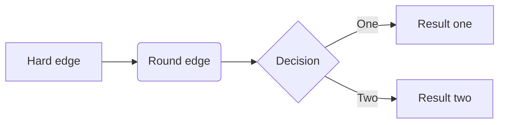
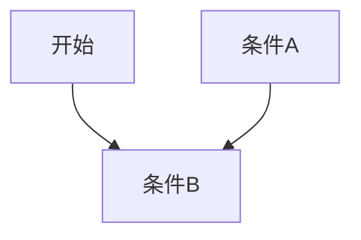
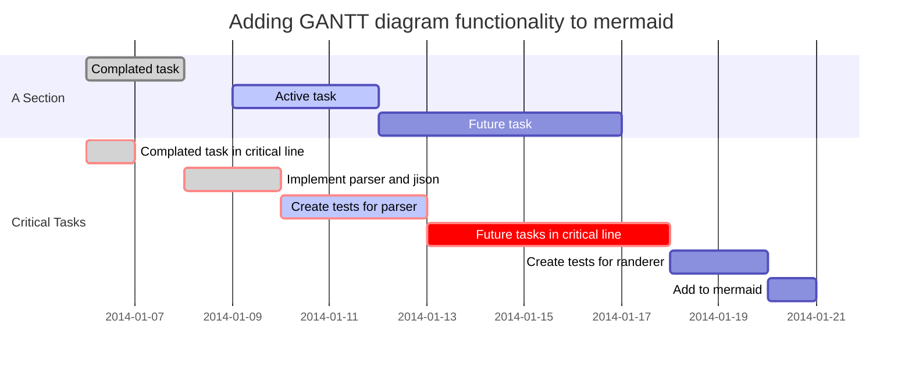
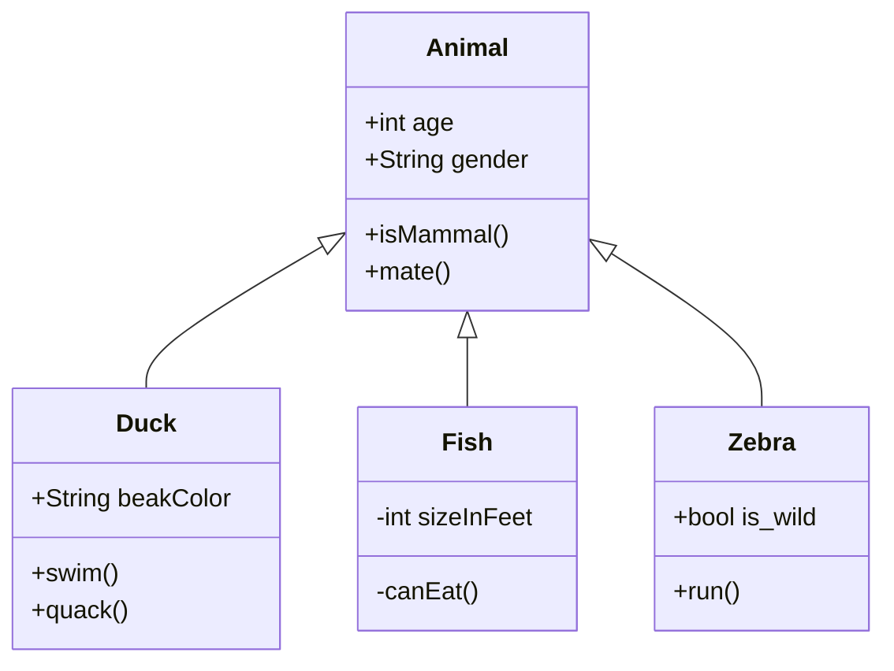
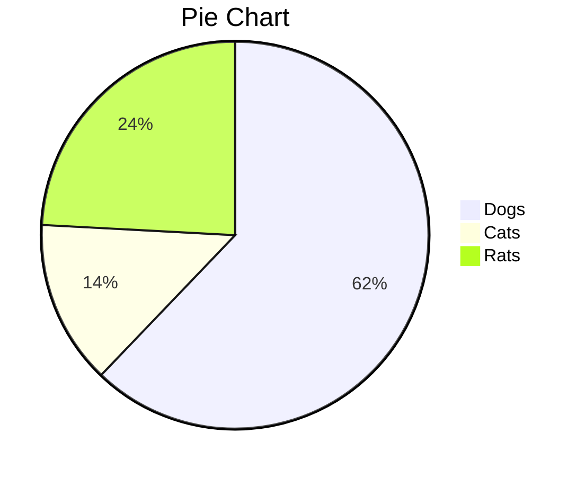

# 基本命令

标题级别：

1. Ctrl 1 - 5：1-5级标题

2. Ctrl B：加粗，**加粗**

3. Ctrl I：斜体，*斜体*

4. Ctrl U：下划线，<u>下划线</u>

5. Shift Alt 5：删除线，~~删除线~~

6. Shift Ctrl Tab上的按键：行内代码区域，`代码区域`

7. Ctrl K：超链接， [显示](真实链接)

8. Ctrl T：表格，

   | vxczv | cxzvcxv |      |
   | :---: | :-----: | ---- |
   |       |         |      |
   |       |         |      |
   |       |         |      |

9. Ctrl Shift Q：引用，

   > 查看这个引用
   >
   > >使用>可以变为多级引用

10. Shift Ctrl I：插入图片

11. 使用```三次：代码块

    ```java
    for(int i = 0; i < 10; i++) {
        if(i<5)
            System.out.println(i + "is less than 5");
    }
    ```

12. 短斜杠、星号、加号，加上Space键：bullet points，可通过Tab键变为下一级


# 进阶命令

1. 任务列表：- [ ] 输入内容

- [ ] like
- [ ] what

2. [^2]：添加引用^

   引用测试[^1]

[^1]: 这是个引用

3. --- Enter：分割线

---

4. ：加一些字：emoji文字

:up:

:arrow_double_up:

:arrow_up:

5. [toc] + enter：生成目录

[toc]

## Markdown拓展功能

1. 流程图

```flow
st=>start: Start
op=>operation: Your Operation
cond=>condition: Yes or No?
e=>end

st->op->cond
cond(yes)->e
cond(no)->op
```



mermaid

1. 流程图



		2. 时序图

```sequence
Alice ->> John: Hello John, how are you?
Note right of John: Rational thoughts
John ->> Bob: How about you?
Bob -->> John: Jolly good!
```

3. 甘特图



4. Class Diagram



5. 状态图

   ```mermaid
   stateDiagram
       [*] --> Still
       Still --> [*]
   
       Still --> Moving
       Moving --> Still
       Moving --> Crash
       Crash --> [*]
   ```

   

6. 饼图



