# Docker基础

## 与传统虚拟机技术的区别

1. Virtual Machine：Linux原生镜像（相当于一台真实的电脑），需要开启多个虚拟机，才能在一台服务器上开启多个环境有要求的服务。占用资源多，冗余步骤多，启动非常缓慢。
2. Docker：隔离的，使用镜像（e.g. 核心环境+jdk+mysql），小巧，启动速度几块，全力压榨服务器性能（基于Go语言开发）。直接运行在宿主主机的内核，没有自己的内核，也没有虚拟硬件，所以轻便了很多。而容器之间相互隔离，每个容器内部都有属于自己的文件系统。


## 为什么要用Docker？

- 更快速的交付与部署
- 部署应用相当于搭积木（e.g. 只升级tomcat，不升级mysql，或者扩展服务器只需要把配置考背一份）
- Docker是内核级别的虚拟化，利用了宿主主机的操作系统


## Docker架构

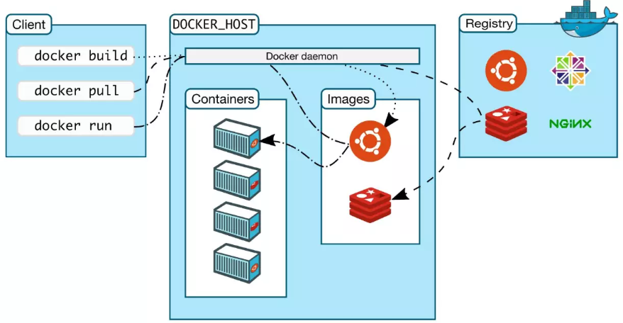

- 镜像（image）：相当于模板，用来创建容器服务，可以创建多个容器：image -> run -> container
- 容器（container）：独立运行一个或一组应用，通过镜像创建，简易（无内核）的linux系统。
- 仓库（repository）：存放镜像的地方，有公有与私有仓库


## Docker运行流程

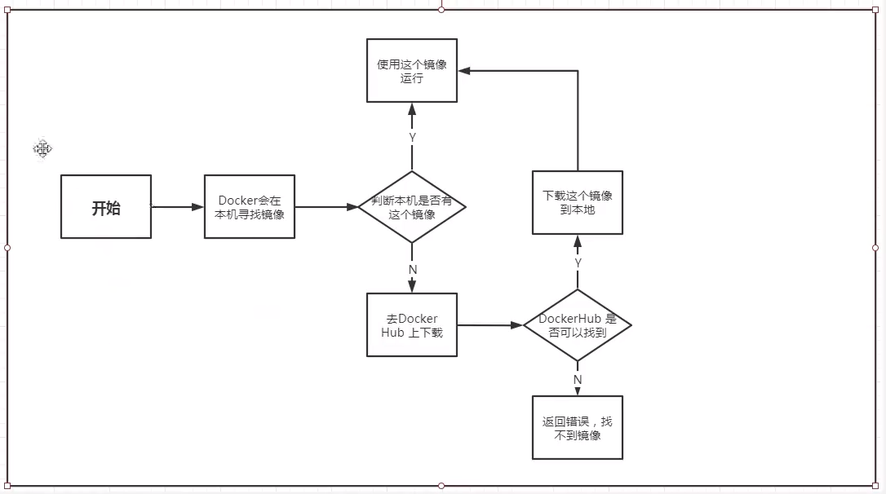


## Docker底层原理

- Docker是一个Client-Server结构的系统，Docker的守护进程运行在主机上。通过Socket从客户端访问。Docker-Server接收到Docker-Client的指令，就会执行这个指令。

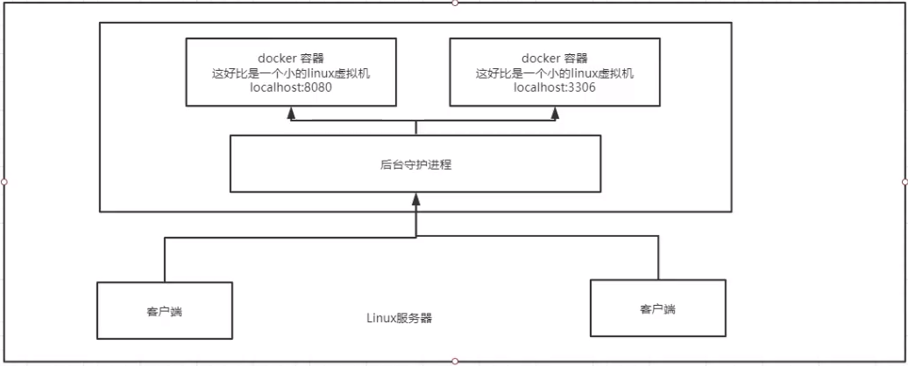


## Docker常用命令

#### 帮助命令

```
docker --version				查看docker相关版本
docker info						查看docker具体配置
docker [command] --help			查看docker对应命令使用帮助
```


#### 镜像命令

```
docker images					查看本地镜像
docker pull [service]			获取指定镜像
docker rmi -f [service]			删除指定镜像
docker image prune -f			删除所有没有被使用的镜像
```


#### 新建容器命令

```
docker run [command] [image]

commands:
	--name="Name"				命名容器为Name
	-d							后台方式
	-it							交互方式
	-p 8080:80					主机端口：容器端口


docker ps						查看运行的容器

exit							退出容器 (Ctrl+P+Q也可以)
```


#### 启动与停止命令

```
docker start [containerId]		启动
docker restart [containerId]	重启
docker stop [containerId]		停止
docker kill [containerId]		强制停止
```


#### Docker其它命令

```
docker logs	-f -t --tail 10 [containerId]		查看日志最后十行内容


docker top [containerId] 						查看容器中的进程


docker inspect	[containerId]					查看容器具体的配置


docker exec -it [containerId] [specialCommand]	进入容器查看
	[specialCommand] 
	e.g.	mysql -u root -p password			进入mysql
			redis-cli							进入redis
			bash								进入linux


docker attach [containerId]						进入真正运行的容器中


docker cp [fileCpFrom] [fileCpPut]				输入输出文件到docker
```


### 作业

#### 作业一：Nginx

1. 搜索镜像（docker hub）
2. 下载镜像（docker pull [ImageName]）
3. 运行测试

```bash
lyk@DESKTOP-EVIJGB4:~$ docker run --name="NginxHomeWork" -d -p 3344:80 nginx
44d76e66557dbba372e67245457bc32810185dee06c70cd9339292a5abed9da3

lyk@DESKTOP-EVIJGB4:~$ docker ps
CONTAINER ID        IMAGE               COMMAND                  CREATED             STATUS              PORTS                  NAMES
44d76e66557d        nginx               "/docker-entrypoint.…"   9 seconds ago       Up 8 seconds        0.0.0.0:3344->80/tcp   NginxHomeWork

lyk@DESKTOP-EVIJGB4:~$ curl localhost:3344
```


端口暴露概念：

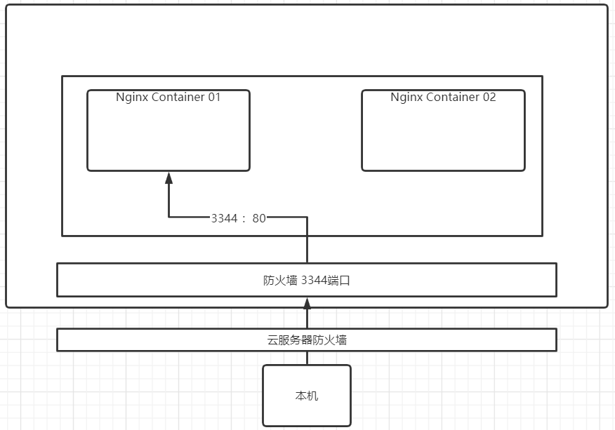

4. 进入Nginx运行容器内部

```shell
docker exec -it NginxHomeWork /bin/bash
```


#### 作业二：Tomcat

```shell
#官方方式：用完既删（--rm）
docker run -it --rm tomcat

#默认是阉割版的，ROOT文件在webapps.dist里面，可以cp *，复制所有文件回webapps里面，即可访问不在404
```


#### 作业三：es(elasticsearch) + kibana

```shell
# es 暴露的端口很多
# es 十分耗费内存
# es 的数据一般放置在安全目录，挂载

# 启动
$ docker run -d --name elasticsearch -p 9200:9200 -p 9300:9300 -e "discovery.type=single-node" elasticsearch:7.8.1

# 测试运行
lyk@DESKTOP-EVIJGB4:~$ curl localhost:9200
{
  "name" : "fc95cc7845fc",
  "cluster_name" : "docker-cluster",
  "cluster_uuid" : "dbl97gWpRTigpxeDZNGX3A",
  "version" : {
    "number" : "7.8.1",
    "build_flavor" : "default",
    "build_type" : "docker",
    "build_hash" : "b5ca9c58fb664ca8bf9e4057fc229b3396bf3a89",
    "build_date" : "2020-07-21T16:40:44.668009Z",
    "build_snapshot" : false,
    "lucene_version" : "8.5.1",
    "minimum_wire_compatibility_version" : "6.8.0",
    "minimum_index_compatibility_version" : "6.0.0-beta1"
  },
  "tagline" : "You Know, for Search"
}

# 查看内存与cpu占用
docker stats

# 增加内存限制 (限制内存占用为最小64m，最大512m)
$ docker run -d --name elasticsearch -p 9200:9200 -p 9300:9300 -e "discovery.type=single-node" 
-e ES_JAVA_OPTS="-Xms=64m -Xmx=512" elasticsearch:7.8.1
```


## 可视化

**什么是portainer?**

Docker图形化界面管理工具（可通过网页形式8088端口对docker内的容器进行管理）

```shell
docker run -d -p 8088:9000 \
--restart=always -v /var/run/docker.sock:/var/run/docker.sock --privileged=true portainer/protainer
```


## Docker镜像详解

### 镜像是什么

镜像是一种轻量级，可执行的独立软件包，用来打包软件运行环境和基于运行环境开发的软件，它包含运行某个软件所需的所有内容，包括代码，运行时库、环境变量和配置文件。

所有的应用直接打包为docker镜像，直接可以跑起来。

### Docker镜像加载原理

>  UnionFS（联合文件系统）

Union文件系统是一种分层，轻量级并且高性能的文件系统，它支持对文件系统的修改作为一次提交，进而一层层的叠加，同时可以将不同目录挂载到同一个虚拟文件系统下（union several directrories into a single virtual filesystem）。Union文件系统是docker镜像的基础。镜像可以通过分层来进行继承，基于基础镜像（没有父镜像），可以制作各种具体的应用镜像。

特性：一次同时加载多个文件系统，但从外部看起来，只能看见依个文件系统，联和加载会把各层文件系统叠加起来，这样最终的文件系统会包含所有底层的文件和目录


> Docker镜像加载原理

docker的镜像实际上是一层一层的文件系统组成的，这种层级的文件系统UnionFS。

bootfs（boot file system），是用于引导系统加载的。主要包含bootloader和kernel, bootloader主要是引导加载kernel, Linux刚启动时会加载bootfs文件系统，在docker镜像的最底层是bootfs。这一层与我们典型的，Linux/Unix系统是一样的，包含boot加载器和内核。当boot加载完成之后，整个内核都在内存中了，此时内存的使用权已由boot转交给内核，此时系统也会卸载bootfs。

rootfs（root file system），在bootfs之上（完成开机之后的步骤）。包含典型的Linux系统中的/dev, /bin, /etc等标准目录与文件。rootfs就是各种不同的操作系统发行版，如Centos，Ubuntu。

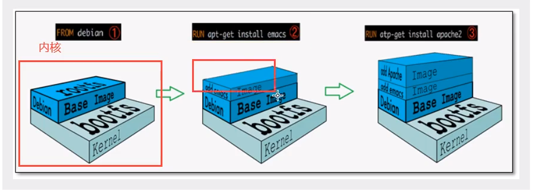

为什么docker下，下载的镜像那么小？

因为镜像是被精简过的，只包含最基本的命令，工具和程序库就可以了。因为底层直接用host的kernel，自己只需要提供rootfs即可。由此可见，对于不同的Linux发行版，bootfs基本一致，rootfs有区别，因此不同的发行版可以公用bootfs。（所以docker的启动是秒级的，大家公用同一个bootfs）


### 分层的理解

> 分层镜像

所有的docker镜像都起始于 **同一个基础镜像层** ，当进行修改或增加新内容的时候，就会在当前镜像层之上，创建新的镜像层。

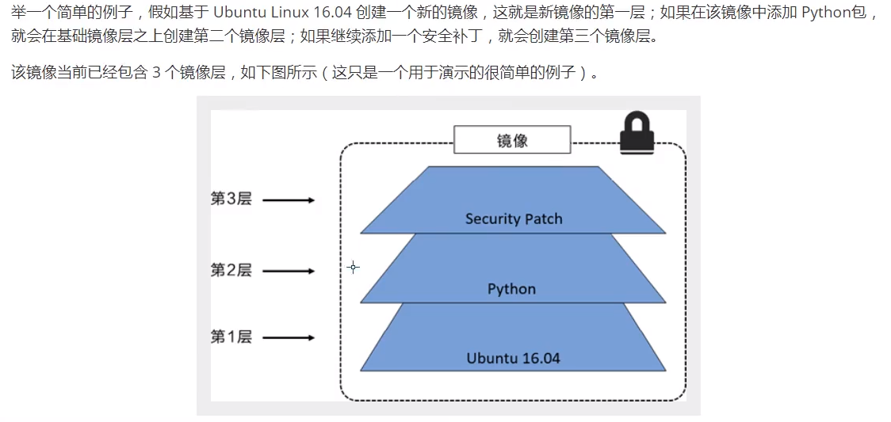


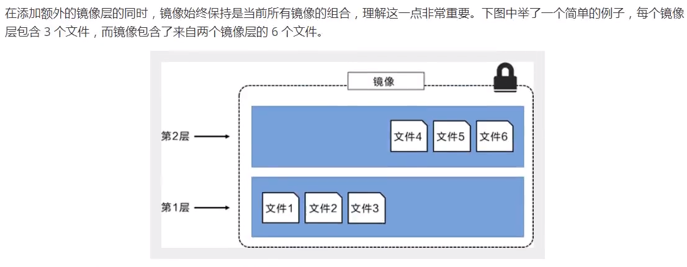

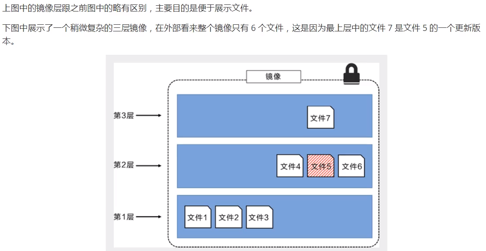

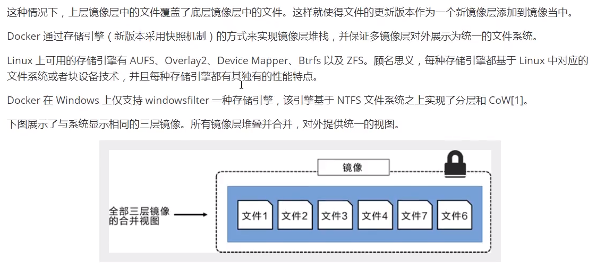

> 特点

Docker镜像默认都是只读的，当容器启动时，一个新的可写层被加载到顶部。

这一层就是我们说的容器层，容器之下的都叫镜像层。

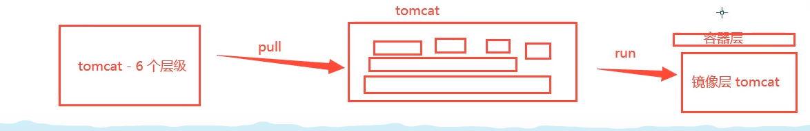


### Commit镜像

```shell
$ docker commit #提交容器成为一个新的副本

$ docker commit -m="提交的描述信息" -a="作者" [containerId] [targetId]:[TAG]

e.g.
$ docker commit -a="yikai" -m="no more 404" ddcd44130245 tomcat02:1.0

lyk@DESKTOP-EVIJGB4:~$ docker images
REPOSITORY           TAG                 IMAGE ID            CREATED             SIZE
tomcat02             1.0                 4e1b857ca255        9 seconds ago       652MB
tomcat               latest              9a9ad4f631f8        5 days ago          647MB
```


## Docker数据卷

#### 什么是数据卷？

docker：将应用与运行的环境打包成一个镜像。

如果数据在容器中，那么我们删除容器，数据就会丢失。**数据持久化**

**数据卷技术** 容器之间有一个数据共享技术，Docker容器中产生的数据，可以同步到本地。

> 就是目录的挂载，挂载到linux上

 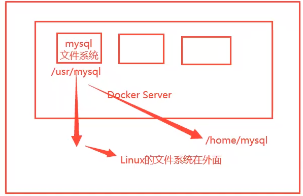

总结：数据卷技术是为了实现 1）容器数据的持久化	2）同步操作	3）容器间共享数据


#### 使用数据卷

> 方式一：直接使用命令进行挂载	-v

```shell
docker run -it -v 主机目录：容器目录

docker run -it -v /home/forTest:/home centos /bin/bash

# 查看
docker inspect [containerId]

 "Mounts": [
            {
                "Type": "bind",
                "Source": "/run/desktop/mnt/host/wsl/docker-desktop-bind-mounts/Ubuntu-18.04/e91ffbf27e2ec7a32d88e74a89e7d1fff4410e3143787f1b47318cdc6f25fa8d",
                "Destination": "/home",
                "Mode": "",
                "RW": true,
                "Propagation": "rprivate"
            }
        ],
```


#### 实战：MySQL的数据持久化

```shell
# 启动MySQL，并且使用数据卷进行挂载conf配置文件，以及具体数据
$ docker run -d -p 3306:3306 -v /home/mysql/conf:/etc/mysql/conf.d -v /home/mysql/data:/var/lib/mysql -e MYSQL_ROOT_PASSWORD=123456 --name=mysql01 mysql
```


#### 具名挂载，匿名挂载，指定路径挂载

```shell
# 匿名挂载
# -v [容器内路径]
$ docker run -d -p --name nginx01 -v /etc/nginx nginx

# 查看所有匿名挂载的路径
$ docker volume ls
local	volume name

# 若为匿名挂载，volume name是一串乱码，具名挂载则是显示你本机的某个目录的名称
$ docker volume inspect 0d4db61b1c4918c693abf9e6544fc51eaebc4fea0ea326297adb0118f90f9def
[
    {
        "CreatedAt": "2020-07-13T07:46:14Z",
        "Driver": "local",
        "Labels": null,
        "Mountpoint": "/var/lib/docker/volumes/0d4db61b1c4918c693abf9e6544fc51eaebc4fea0ea326297adb0118f90f9def/_data",
        "Name": "0d4db61b1c4918c693abf9e6544fc51eaebc4fea0ea326297adb0118f90f9def",
        "Options": null,
        "Scope": "local"
    }
]
```


**如何区分？**

```shell
# 如何区分具名挂载，匿名挂载，指定路径挂载？
-v 容器内路径				  # 匿名挂载
-v 卷名：容器内路径				# 具名挂载
-v /宿主主机路径：容器内路径     # 指定路径挂载 
```

拓展：

```shell
# 通过 -v 容器内路径：ro rw 改变读写权限
# ro	read only
# rw	read write

# 一旦设置了权限，ro，只能对数据在宿主主机进行操作
$ docker run -d -P --name nginx02 -v juming-nginx:/etc/nginx:ro nginx
$ docker run -d -P --name nginx02 -v juming-nginx:/etc/nginx:rw nginx
```


## DockerFile

### 什么是DockerFile？

是用来构建docker的镜像的第二种方法（第一种是commit），直接编写脚本文件进行构建镜像。

```shell
# 一个简单的dockerfile
FROM centos
VOLUME ["volume01", "volume02"]
CMD echo "----end----"
CMD /bin/bash
# 每个命令相当于一层


# 进行构建镜像
$ docker build -f /home/docker-learning/dockerfile1 -t ceshi/centos:1.5 .
Sending build context to Docker daemon  29.74kB
Step 1/4 : FROM centos
 ---> 831691599b88
Step 2/4 : VOLUME ["volume01", "volume02"]
 ---> Running in 033f1c5c0caf
Removing intermediate container 033f1c5c0caf
 ---> 4161388d14ae
Step 3/4 : CMD echo "----end----"
 ---> Running in 7341862a3cd1
Removing intermediate container 7341862a3cd1
 ---> 33d06d220c03
Step 4/4 : CMD /bin/bash
 ---> Running in 3e7862e410e9
Removing intermediate container 3e7862e410e9
 ---> 8b8dd85dfe9b
Successfully built 8b8dd85dfe9b
Successfully tagged ceshi/centos:1.5

# 查看images
$ docker images
REPOSITORY           TAG                 IMAGE ID            CREATED             SIZE
ceshi/centos         1.5                 8b8dd85dfe9b        7 seconds ago       215MB

$ docker run -it 8b8dd85dfe9b /bin/bash
[root@96fd59c5f666 /]# ls
bin  etc   lib    lost+found  mnt  proc  run   srv  tmp  var       volume02
dev  home  lib64  media       opt  root  sbin  sys  usr  volume01
# 可以发现我们挂载的volume01和volume02，两个数据卷目录都在里面
```

这两卷肯定是与外面外面的有挂载的


### 数据卷容器

可以实现数据在两个容器中同步


```shell
# 测试

$ docker run -it --name docker01 test-tom:1.0 # 开启第一个tomcat

$ docker run -it --name docker02 --volumes-from docker01 test-tom:1.0 
# 开启第二个tomcat，并且同步第一个docker的数据到自己这里

# 可以发现，当我们在docker01里面的volume添加文件后，docker02也能看见。而在docker02的volume里面添加文件，同样的在docker01可以发现，两边都实现了同步。
```

此时的docker01即为数据卷容器，可以无限的添加 --volumes-from。

如果我们删除了docker01呢？**可以，依旧可以访问**，因为docker的共享数据相当于是 **双向拷贝** 的情况。

```shell
# mysql 实现数据共享

# 匿名挂载
$ docker run -d -p 3300:3306 -v /etc/mysql/conf.d -v /var/lib/mysql -e MYSQL_ROOT_PASSWORD=123455 --name mysql01 mysql

$ docker run -d -p 3301:3306 -e MYSQL_ROOT_PASSWORD=123455 --name mysql02 --volumes-from mysql01 mysql

# 即可实现容器间数据同步
```

**结论**

容器之间的配置信息的传递，数据卷容器的生命周期，一直持续到没有容器为止。

但只要持久化到本地，本地数据一直都会存在。


### 构建DockerFile

步骤：

1. 编写一个DockerFile
2. docker build 构建一个镜像
3. docker run 运行镜像
4. docker push 发布镜像 （docker hub、阿里云镜像仓库）


官方dockerfile：

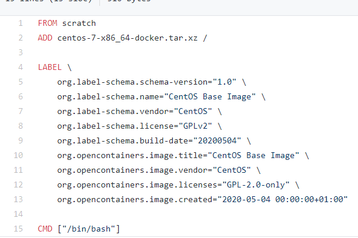


**基础知识**

1. 每个指令都必须是大写字母
2. 执行顺序从上往下
3. 每一个指令都会创建提交一个新的镜像层，并提交

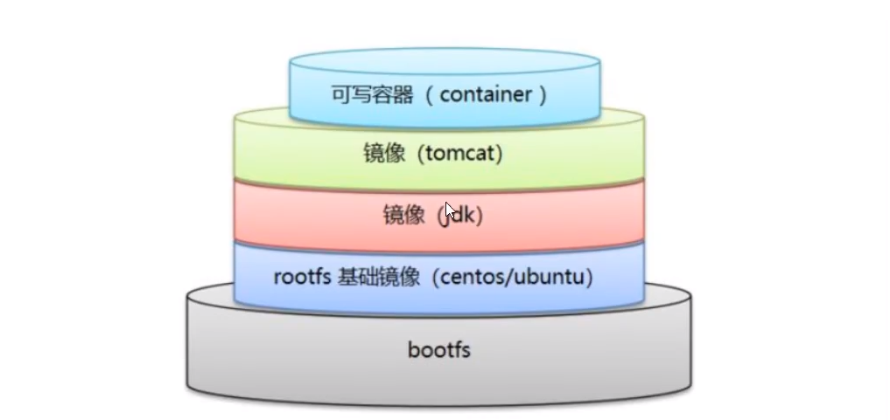

- docker file：构建文件，定义了一切的步骤，源代码

- docker images：通过docker file构建生成的镜像，最终发布和运行的产品
- docker 容器：容器就是镜像运行起来提供服务器的


### DockerFile指令


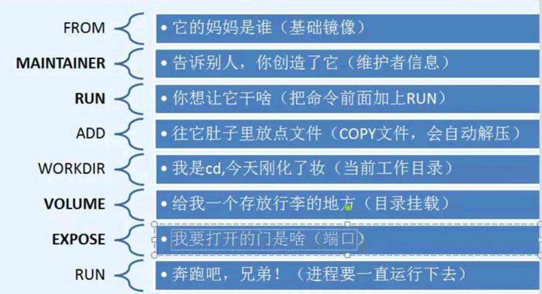

```shell
FROM			# 基础镜像
MAINTAINER		# 镜像维护者名字
RUN				# 镜像构建时需要运行的命令
ADD				# 步骤：添加内容（e.g.tomcat压缩包）
WORKDIR			# 镜像的工作目录
VOLUME			# 挂载的目录
EXPOSE			# 保留端口配置

CMD				# 指定容器运行时，需要执行的命令，只有最后一个执行，可被替换
ENTRYPOINT		# 指定这个容器启动时需要执行的命令，可以追加命令

ONBUILD			# 当构建一个被继承的dockerfile，这时候就会运行ONBUILD命令（触发指令）

COPY			# 将文件拷贝到镜像中
ENV				# 构建时设置的环境变量
```


#### 实战

99%的镜像都是首先 **FROM scratch**， 然后再构建。

```shell
# 构建一个centos

FROM centos
MAINTAINER myself<..@....>

ENV MYPATH /usr/local
WORKDIR $MYPATH

RUN yum -y install vim
RUN	yum -y install net-tools

EXPOSE 80

CMD echo $MYPATH
CMD echo "----end----"
CMD /bin/bash
```


```shell
# 构建
$ docker build -f /home/docker-learning/dockerfile1 -t mycentos:0.1
```


#### CMD与ENTRYPOINT的区别

在docker file中：

```shell
# 测试CMD

FROM centos
CMD ["ls", "-a"] # 执行一个命令

$ docker build -f fileName -t targetName:version .
$ docker run [containerId] -l

# 会报错，它用了-l来替换-a，但是-l是非法的
```

构建成功后，直接执行CMD（只有最后一条执行），追加命令会替换 （当run它的时候）

```shell
# 测试ENTRYPOINT

FROM centos
ENTRYPOINT [ls", "-a"]

$ docker build -f fileName -t targetName:version .
$ docker run [containerId] -l

# 不会报错，他会使用-l 放在-a之前，而不是替换，是拼接命令
```


#### 构建Tomcat

1. 准备镜像文件tomcat的压缩包，jdk的压缩包
2. 编写dockerfile文件（官方命名：'Dockerfile'，就不需要-f了）

```shell
FROM centos
MAINTAINER mingzi<email@address.com>

COPY readme.txt /usr/local/readme.txt

ADD jdk-8ul1-linux-x64.tar.gz /usr/local/
ADD apache-tomcat-9.0.22.tar.gz /usr/local/

RUN yum -y install vim

ENV MYPATH /usr/local
WORKDIR $MYPATH

ENV JAVA_HOME /usr/local/jdk1.8.0_11
ENV CLASSPATH $JAVA_HOME/lib/dt.jar:$JAVA_HOME/lib/tools.jar 
ENV CATALINA_HOME /usr/local/apache-tomcat-9.0.22
ENV CATALINA_BASH /usr/local/apache-tomcat-9.0.22
ENV PATH $PATH:$JAVA_HOME/bin:$CATALINA_HOME/lib:$CATALINA_HOME/bin

EXPOSE 8080

CMD /usr/local/apache-tomcat-9.0.22/bin/startup.sh && tail -F /url/local/apache-tomcat-9.0.22/bin/logs/catalina.out
```

3. 构建与运行容器

```shell
$ docker build -t diytomcat .
$ docker run -d -p 9090:8080 --name diytomcattesting -v /home/tomcat/test:usr/local/appache-tomcat-9.0.22/webapps/test -v /home/tomcat/tomcatlogs:/usr/local/appache-tomcat-9.0.22/logs diytomcat
```

4. 发布

   由于使用了挂载，本地修改的文件，直接等于发布

5. Push到DockerHub

> 发到Docker Hub

```shell
$ docker push Name/tomcat
```

> 发到阿里云上

- 登录阿里云
- 找到容器镜像服务
- 创建命名空间
- 创建容器镜像

https://www.bilibili.com/video/BV1og4y1q7M4?p=32


## Docker全流程小结


```shell
docker save [imageId] 	# 保存一个或多个imagefile进入tar包
docker load [.tar]		# 从tar导入images
```


# Docker网络

## 理解docker0

在宿主主机下使用

```shell
$ ip addr
```

会发现一个docker0这样的网络。

我们运行一个tomcat，然后

```shell
$ docker exec -it my-tomcat-container ip addr
```

会发现得到一个eh0的地址，这是由docker分配给这个容器的

```shell
1: lo: <LOOPBACK,UP,LOWER_UP> mtu 65536 qdisc noqueue state UNKNOWN group default qlen 1000
    link/loopback 00:00:00:00:00:00 brd 00:00:00:00:00:00
    inet 127.0.0.1/8 scope host lo
       valid_lft forever preferred_lft forever
2: sit0@NONE: <NOARP> mtu 1480 qdisc noop state DOWN group default qlen 1000
    link/sit 0.0.0.0 brd 0.0.0.0
31: eth0@if32: <BROADCAST,MULTICAST,UP,LOWER_UP> mtu 1500 qdisc noqueue state UP group default
    link/ether 02:42:ac:11:00:02 brd ff:ff:ff:ff:ff:ff link-netnsid 0
    inet 172.17.0.2/16 brd 172.17.255.255 scope global eth0
       valid_lft forever preferred_lft forever
```

**宿主Linux系统是否能ping通这个docker容器？**

1. 容器之间可以ping通
2. 容器可以ping通宿主ip，但是宿主ip无法ping通容器（理论上是可以的，但是WSL2下发现不行，可能跟防火墙有些关系）

> 原理

1. 我们每启动一个docker容器，docker就会给docker容器分配一个ip，只要安装docker就会有一个网卡docker0桥接模式，使用的技术是veth-pair技术。
2. veth-pair就是虚拟接口技术，都是成对出现的，所以使用evth-pair可以连接虚拟网络设备。

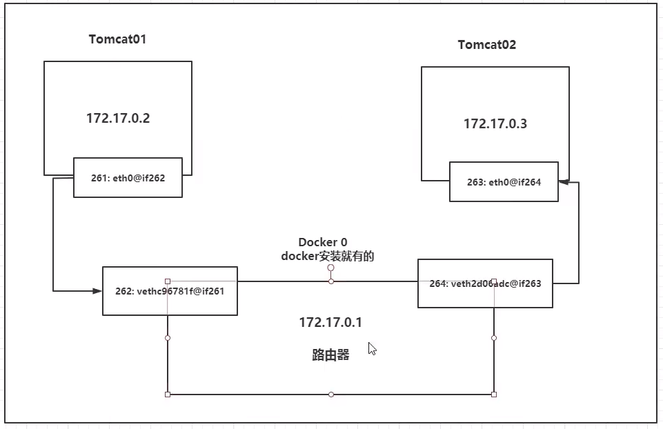

**实际上，容器之间的通信，是通过Docker0，来进行”转发“的，因为相当于内网，转发速率很高**

在容器不指定网络的情况下，都是docker0路由这些消息的，docker会给容器分配一个默认的可用的ip。

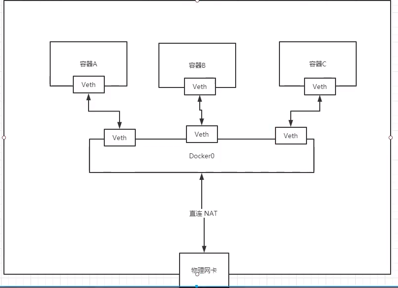


只要容器停止，对应网桥一对就没有了。


#### --link

> 思考：如果每次启动，docker中的mysql的ip都会发生变化，是否能不使用ip，而使用容器名称进行访问？

（WSL2下可以通过容器名ping通，若不行，可以尝试加上--link + 容器名称再启动容器，但是反向ping不通，除非都使用这个--link）


### network命令

```shell
$ docker network + # 可以查看当前docker中的network

# 通过查看docker中容器的 /etc/host 文件，可以看见一些绑定（名字与ip的映射）
```


## 自定义网络

**网络模式**

- bridge：桥接（默认）
- none：不配置网络
- host：和宿主机共享网络
- container：容器内网络联通（局限很大）

```shell
# 运行一个容器
$ docker run -d -P --name tomcat01 --net bridge tomcat # 默认也是bridge模式

# 自己创建一个网络
# --driver bridge
# --subnet 192.168.0.0/16
# --gateway 192.168.0.1
$ docker network create --driver bridge --subnet 192.168.0.0/16 --gateway 192.168.0.1 mynet
4c872f01e181d307e55c095a6c6457076147a784f04aaf2fa4e3547e2d3aa4aa

$ docker network ls
NETWORK ID          NAME                DRIVER              SCOPE
1e748603ebd1        bridge              bridge              local
02fa9dfc2025        host                host                local
4c872f01e181        mynet               bridge              local
1e359a275fba        none
```

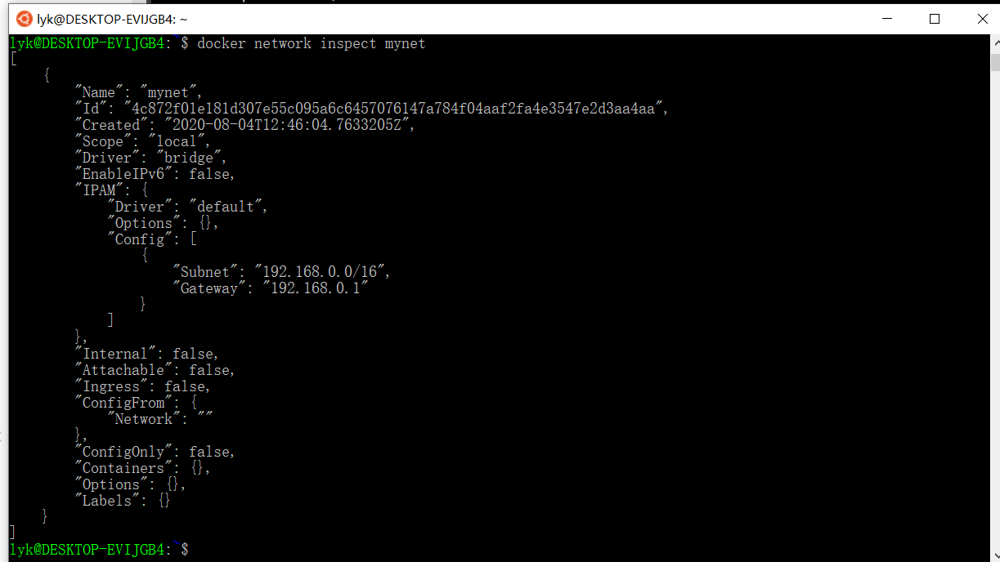


```shell
# 启动两个tomcat，网络部署在mynet上
$ docker run -d -P --name tomcat-net-01 --net mynet tomcat
da7b84c81fc6ffbb24cd152ca710fd393f81edd27f0efd1c74182f7a9f2b1ebf

$ docker run -d -P --name tomcat-net-02 --net mynet tomcat
d4d5427a631d176bef7383043c95279b85b5634943154a0f0a7687d2ea5b96aa

# 再次inspect mynet，发现container中添加了：
"ConfigOnly": false,
        "Containers": {
            "d4d5427a631d176bef7383043c95279b85b5634943154a0f0a7687d2ea5b96aa": {
                "Name": "tomcat-net-02",
                "EndpointID": "50c1001d663aba99ce45caef7d0dff70a0cfd0a5c308149c77f4ba008e862a60",
                "MacAddress": "02:42:c0:a8:00:03",
                "IPv4Address": "192.168.0.3/16",
                "IPv6Address": ""
            },
            "da7b84c81fc6ffbb24cd152ca710fd393f81edd27f0efd1c74182f7a9f2b1ebf": {
                "Name": "tomcat-net-01",
                "EndpointID": "edbcd506e70c650e99bf7a134a96b75c90bee5e6935d4c9e2deed688c405eb01",
                "MacAddress": "02:42:c0:a8:00:02",
                "IPv4Address": "192.168.0.2/16",
                "IPv6Address": ""
            }
        },
        "Options": {},
        "Labels": {}
       

# 不使用--link也可以使用容器名来ping通
```


### 网络连通

我们可以使用network中的connect命令，让某个容器，连接上某个网络；

```shell
$ docker network connect mynet tomcat01

# 随后inspect我们的mynet，发现：
"Containers": {
            "862d4e5a7a55022b85b57ea3f6bdaaaa3ba11057a5405abf35bfdd776c569802": {
                "Name": "tomcat01",
                "EndpointID": "380bfc1408e51f17db73ac7ccd69cbe9c414571b558b4c019f76d0145d1a6490",
                "MacAddress": "02:42:c0:a8:00:04",
                "IPv4Address": "192.168.0.4/16",
                "IPv6Address": ""
            },
            "d4d5427a631d176bef7383043c95279b85b5634943154a0f0a7687d2ea5b96aa": {
                "Name": "tomcat-net-02",
                "EndpointID": "50c1001d663aba99ce45caef7d0dff70a0cfd0a5c308149c77f4ba008e862a60",
                "MacAddress": "02:42:c0:a8:00:03",
                "IPv4Address": "192.168.0.3/16",
                "IPv6Address": ""
            },
            "da7b84c81fc6ffbb24cd152ca710fd393f81edd27f0efd1c74182f7a9f2b1ebf": {
                "Name": "tomcat-net-01",
                "EndpointID": "edbcd506e70c650e99bf7a134a96b75c90bee5e6935d4c9e2deed688c405eb01",
                "MacAddress": "02:42:c0:a8:00:02",
                "IPv4Address": "192.168.0.2/16",
                "IPv6Address": ""
            }
        },
        
# tomcat01，也出现在containers里面，而且是分配了一个mynet的ip地址给他！！！！！！！
# 就是官方所说的，一个容器，两个ip
```

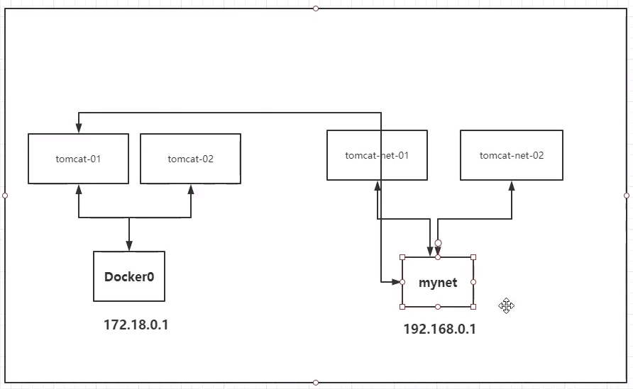


## 实战：部署Redis集群

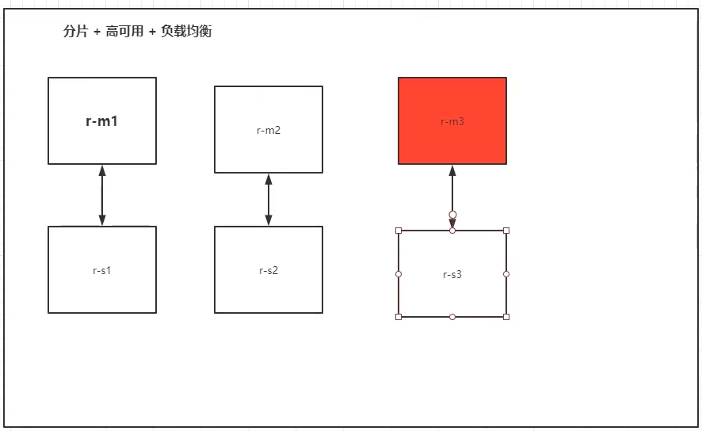

```shell
# 创建网络
$ docker network create redisnet --subnet 172.38.0.0/16

# 使用脚本创建6个redis
for port in $(seq 1 6); \
do \
sudo mkdir -p /mydata/redis/node-${port}/conf
sudo touch /mydata/redis/node-${port}/conf/redis.conf\
sudo cat << EOF >/mydata/redis/node-${port}/conf/redis.conf
port 6379
bind 0.0.0.0
cluster-enabled yes
cluster-config-file nodes.conf
cluster-node-timeout 5000
cluster-announce-ip 172.38.0.1${port}
cluster-announce-port 6379
cluster-announce-bus-port 16379
appendonly yes
EOF
done

# 使用脚本运行6个redis容器
docker run -p 6371:6379 -p 16371:16379 --name redis-1 \
-v /mydata/redis/node-1/data:/data \
-v /mydata/redis/node-1/conf/redis.conf:/etc/redis/redis.conf \
-d --net redisnet --ip 172.38.0.11 redis:6.0.6-alphine redis-server /etc/redis/redis.conf

docker run -p 6372:6379 -p 16372:16379 --name redis-2 \
-v /mydata/redis/node-2/data:/data \
-v /mydata/redis/node-2/conf/redis.conf:/etc/redis/redis.conf \
-d --net redisnet --ip 172.38.0.12 redis:6.0.6-alphine redis-server /etc/redis/redis.conf

docker run -p 6373:6379 -p 16373:16379 --name redis-3 \
-v /mydata/redis/node-3/data:/data \
-v /mydata/redis/node-3/conf/redis.conf:/etc/redis/redis.conf \
-d --net redisnet --ip 172.38.0.13 redis redis-server /etc/redis/redis.conf

docker run -p 6374:6379 -p 16374:16379 --name redis-4 \
-v /mydata/redis/node-4/data:/data \
-v /mydata/redis/node-4/conf/redis.conf:/etc/redis/redis.conf \
-d --net redisnet --ip 172.38.0.14 redis redis-server /etc/redis/redis.conf

docker run -p 6375:6379 -p 16375:16379 --name redis-5 \
-v /mydata/redis/node-5/data:/data \
-v /mydata/redis/node-5/conf/redis.conf:/etc/redis/redis.conf \
-d --net redisnet --ip 172.38.0.15 redis redis-server /etc/redis/redis.conf

docker run -p 6376:6379 -p 16376:16379 --name redis-6 \
-v /mydata/redis/node-6/data:/data \
-v /mydata/redis/node-6/conf/redis.conf:/etc/redis/redis.conf \
-d --net redisnet --ip 172.38.0.16 redis redis-server /etc/redis/redis.conf
```

开始创建集群

```shell
$ docker exec -it redis-1 /bin/sh

$ redis-cli --cluster create 172.38.0.11:6379 172.38.0.12:6379 172.38.0.13:6379 172.38.0.14:6379 172.38.0.15:6379 172.38.0.16:6379 --cluster-replicas 1

# 测试redis集群，需要每次使用redis-cli -c才是找集群
$ redis-cli -c
> cluster info
> cluster nodes
> set ....

# 我们可以通过set一个值，然后看它存储在哪台redis上。然后停掉那一台redis，再用get，来确保备份redis可用
```


## 实战：SpringBoot微服务打包Docker镜像

1. 打包springboot然后build为jar包
2. java -jar .jar测试打包之后是否能运行
3. 在idea中编写Dockerfile

```shell
FROM java:8

COPY *.jar /app.jar

CMD ["--server.port=8080"]

EXPOSE 8080

ENTRYPOINT ["java", "-jar", "/app.jar"]
```

4. 以后发布，只需要上传jar，和Dockerfile。随后即可image build，再运行容器，即可
